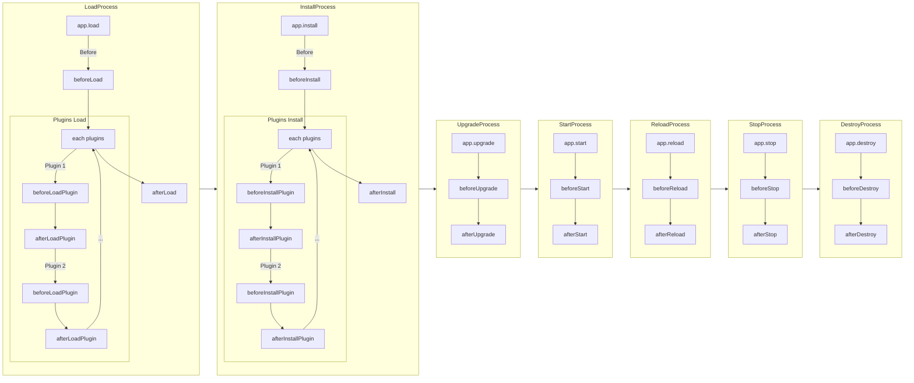
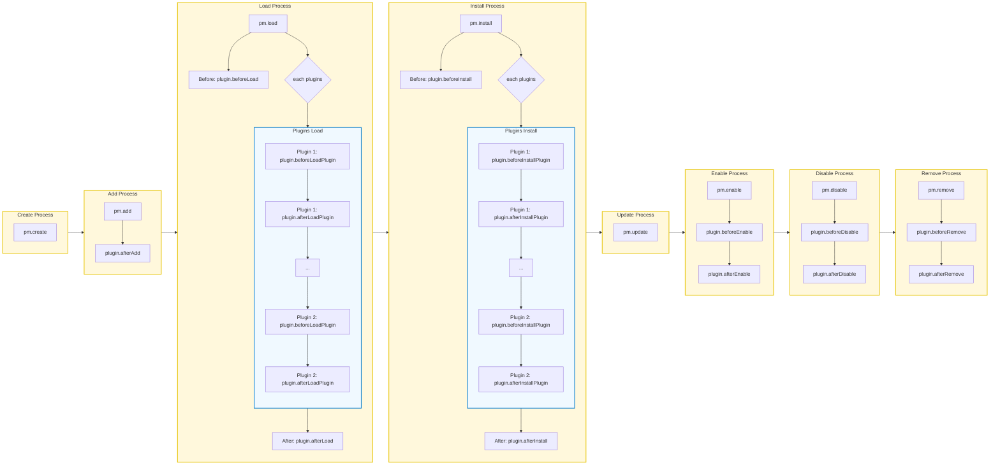
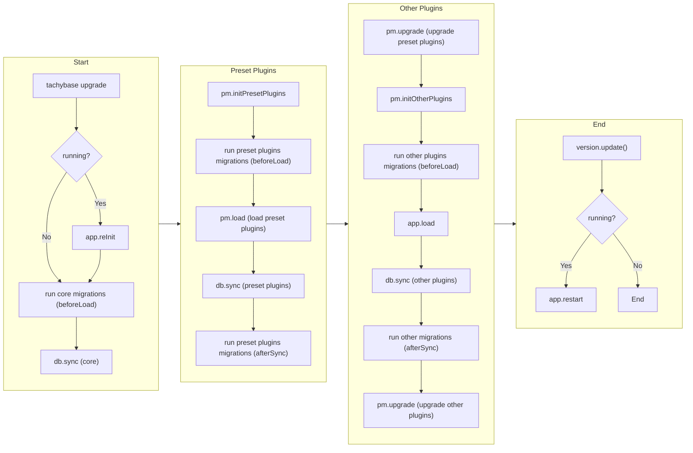

# 生命周期

应用生命周期包括以下步骤：

```mermaid
flowchart LR
    subgraph LoadProcess
        A["app.load"] -->|Before| B["beforeLoad"]
        B --> C["each plugins"]
        subgraph Plugins Load
            C -->|Plugin 1| D1["beforeLoadPlugin"]
            D1 --> E1["afterLoadPlugin"]
            E1 -->|Plugin 2| D2["beforeLoadPlugin"]
            D2 --> E2["afterLoadPlugin"]
            E2 -->|...| C
        end
        C --> F["afterLoad"]
    end

    subgraph InstallProcess
        G["app.install"] -->|Before| H["beforeInstall"]
        H --> I["each plugins"]
        subgraph Plugins Install
            I -->|Plugin 1| J1["beforeInstallPlugin"]
            J1 --> K1["afterInstallPlugin"]
            K1 -->|Plugin 2| J2["beforeInstallPlugin"]
            J2 --> K2["afterInstallPlugin"]
            K2 -->|...| I
        end
        I --> L["afterInstall"]
    end

    subgraph UpgradeProcess
        M["app.upgrade"] --> N["beforeUpgrade"]
        N --> O["afterUpgrade"]
    end

    subgraph StartProcess
        P["app.start"] --> Q["beforeStart"]
        Q --> R["afterStart"]
    end

    subgraph ReloadProcess
        S["app.reload"] --> T["beforeReload"]
        T --> U["afterReload"]
    end

    subgraph StopProcess
        V["app.stop"] --> W["beforeStop"]
        W --> X["afterStop"]
    end

    subgraph DestroyProcess
        Y["app.destroy"] --> Z["beforeDestroy"]
        Z --> AA["afterDestroy"]
    end

    %% 连接主流程
    LoadProcess --> InstallProcess
    InstallProcess --> UpgradeProcess
    UpgradeProcess --> StartProcess
    StartProcess --> ReloadProcess
    ReloadProcess --> StopProcess
    StopProcess --> DestroyProcess
```

插件的生命周期包括以下步骤:

```mermaid
flowchart LR
    %% Subgraph for Create Process
    subgraph Column1 [Create Process]
        direction TB
        A[pm.create]
    end

    %% Subgraph for Add Process
    subgraph Column2 [Add Process]
        direction TB
        B[pm.add]
        B --> C[plugin.afterAdd]
    end

    %% Subgraph for Load Process
    subgraph Column3 [Load Process]
        direction TB
        D[pm.load]
        D --> E[Before: plugin.beforeLoad]
        D --> F{each plugins}
        subgraph PluginsLoad [Plugins Load]
            direction TB
            G[Plugin 1: plugin.beforeLoadPlugin]
            G --> H[Plugin 1: plugin.afterLoadPlugin]
            H --> I[...]
            I --> J[Plugin 2: plugin.beforeLoadPlugin]
            J --> K[Plugin 2: plugin.afterLoadPlugin]
        end
        F --> PluginsLoad
        PluginsLoad --> L[After: plugin.afterLoad]
    end

    %% Subgraph for Install Process
    subgraph Column4 [Install Process]
        direction TB
        M[pm.install]
        M --> N[Before: plugin.beforeInstall]
        M --> O{each plugins}
        subgraph PluginsInstall [Plugins Install]
            direction TB
            P[Plugin 1: plugin.beforeInstallPlugin]
            P --> Q[Plugin 1: plugin.afterInstallPlugin]
            Q --> R[...]
            R --> S[Plugin 2: plugin.beforeInstallPlugin]
            S --> T[Plugin 2: plugin.afterInstallPlugin]
        end
        O --> PluginsInstall
        PluginsInstall --> U[After: plugin.afterInstall]
    end

    %% Subgraph for Update Process
    subgraph Column5 [Update Process]
        direction TB
        V[pm.update]
    end

    %% Subgraph for Enable Process
    subgraph Column6 [Enable Process]
        direction TB
        W[pm.enable]
        W --> X[plugin.beforeEnable]
        X --> Y[plugin.afterEnable]
    end

    %% Subgraph for Disable Process
    subgraph Column7 [Disable Process]
        direction TB
        Z[pm.disable]
        Z --> AA[plugin.beforeDisable]
        AA --> AB[plugin.afterDisable]
    end

    %% Subgraph for Remove Process
    subgraph Column8 [Remove Process]
        direction TB
        AC[pm.remove]
        AC --> AD[plugin.beforeRemove]
        AD --> AE[plugin.afterRemove]
    end

    %% Connections between columns
    Column1 --> Column2
    Column2 --> Column3
    Column3 --> Column4
    Column4 --> Column5
    Column5 --> Column6
    Column6 --> Column7
    Column7 --> Column8

    %% Styles
    classDef processBox fill:#fff8dc,stroke:#e6c300,stroke-width:2px;
    classDef pluginBox fill:#f0f9ff,stroke:#007acc,stroke-width:2px;

    class Column1,Column2,Column3,Column4,Column5,Column6,Column7,Column8 processBox;
    class PluginsLoad,PluginsInstall pluginBox;

```

upgrade 生命周期包括以下步骤：

```mermaid
flowchart LR
    %% 主流程
    subgraph Start
    direction TB
        A["tachybase upgrade"] --> B{running?}
        B -- Yes --> C["app.reInit"]
        B -- No --> D["run core migrations (beforeLoad)"]
        C --> D
        D --> E["db.sync (core)"]
    end

    %% 第一列：PresetPlugins
    subgraph PresetPlugins [Preset Plugins]
        G["pm.initPresetPlugins"] --> H["run preset plugins migrations (beforeLoad)"]
        H --> I["pm.load (load preset plugins)"]
        I --> J["db.sync (preset plugins)"]
        J --> K["run preset plugins migrations (afterSync)"]
    end

    %% 第二列：OtherPlugins
    subgraph OtherPlugins [Other Plugins]
        L["pm.upgrade (upgrade preset plugins)"] --> M["pm.initOtherPlugins"]
        M --> N["run other plugins migrations (beforeLoad)"]
        N --> O["app.load"]
        O --> P["db.sync (other plugins)"]
        P --> Q["run other migrations (afterSync)"]
        Q --> R["pm.upgrade (upgrade other plugins)"]
    end

    %% 版本更新流程
    subgraph End
        T["version.update()"] --> U{running?}
        U -- Yes --> V["app.restart"]
        U -- No --> W["End"]
    end

    Start --> PresetPlugins
    PresetPlugins --> OtherPlugins
    OtherPlugins --> End
```
