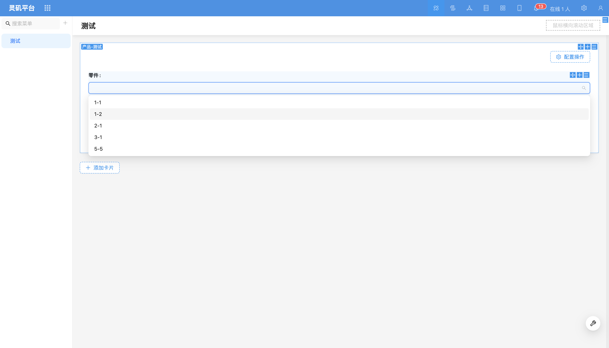
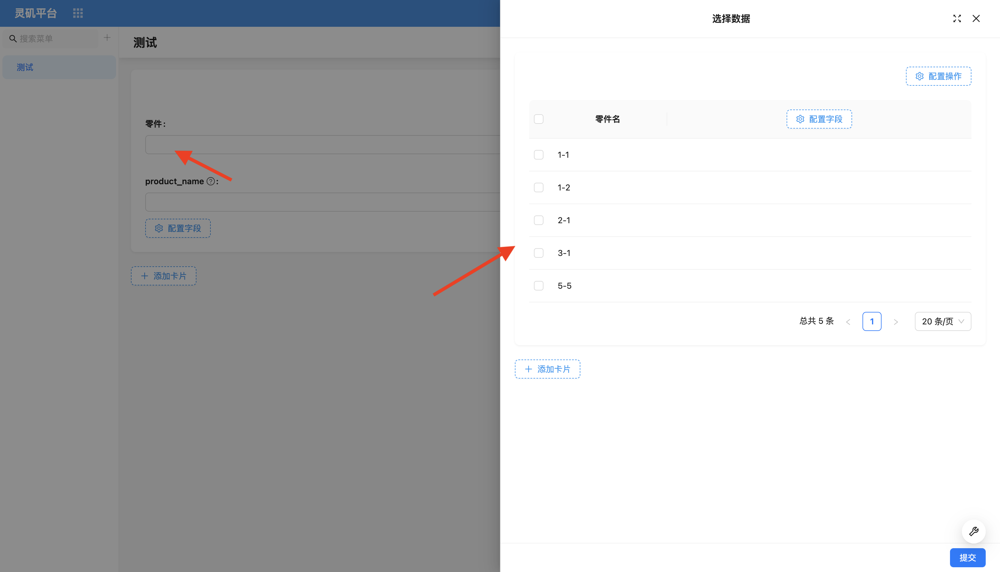
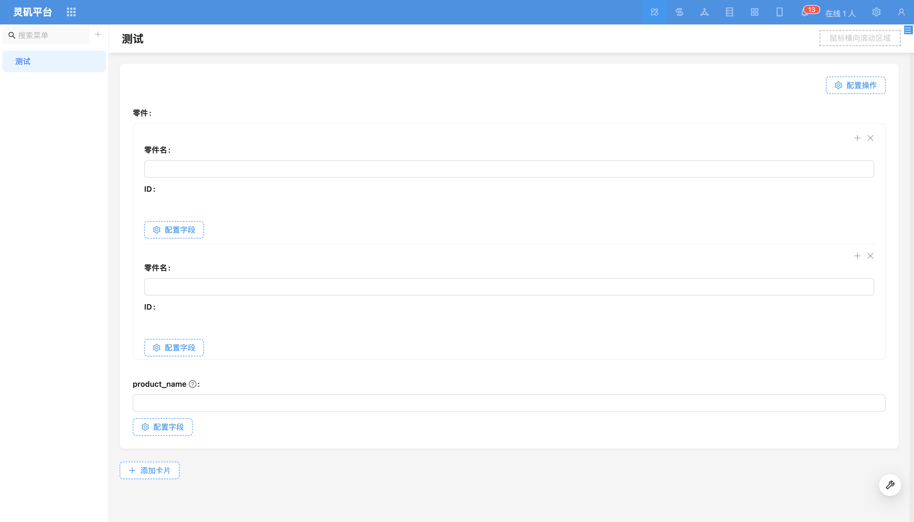
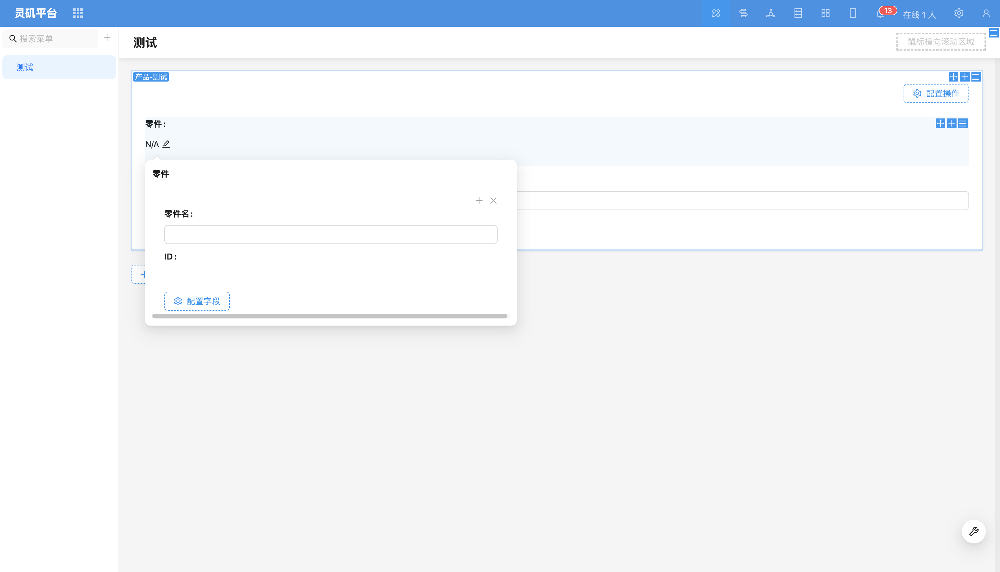
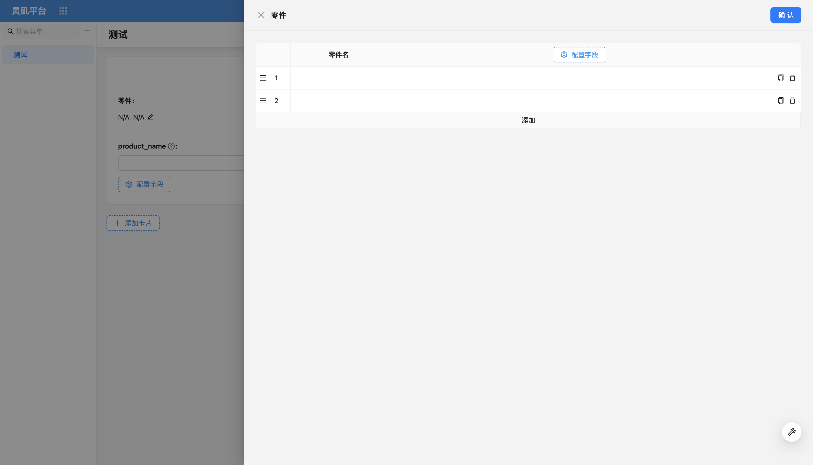
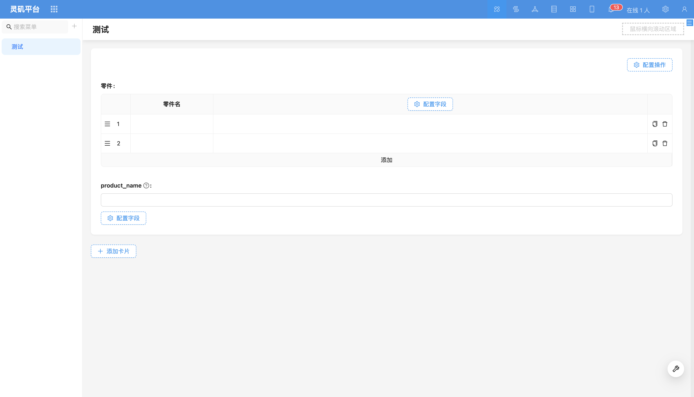

# Association Field Components

### Overview

Tachybase's association field components are designed to help users better display and handle related data. Regardless of relationship type, these components have flexibility and versatility, allowing users to select and configure these components according to specific needs.

#### Dropdown Selector
Except for all relationship fields where the target table is a file table, the default component in edit mode is a dropdown selector. The dropdown options display the value of the title field, suitable for scenarios where associated data can be quickly selected by displaying a single key field information.

For more content, refer to [Dropdown Selector](./specific/select.md)

#### Data Picker
The data picker presents data in modal form. Users can configure fields to be displayed in the data picker (including relationship fields of relationships) to more precisely select associated data.

For more content, refer to [Data Picker](./specific/date-picker.md)

<!-- #### Cascade Selector
Cascade selector is suitable for relationship fields where the target table is a tree table, allowing users to select data according to the hierarchical structure of tree table data. Suitable for scenarios such as province/city/district, industry classification, product attributes, and other cascading selections.

For more content, refer to [Cascade Selector](./specific/cascade-select.md) -->

#### Sub-form
When handling more complex relationship data, using dropdown selectors or data pickers for operations can be inconvenient. In this case, users need to frequently open modals. For this scenario, sub-forms can be used. Users can directly maintain relationship table fields on the current page or current modal block without repeatedly opening new modals, making the operation flow smoother. Multi-level relationships are displayed in nested form.

For more content, refer to [Sub-form](./specific/nester.md)

#### Sub-form (Popover)
When relationship levels are deep and there are many data fields, sub-form layout may seem lengthy and difficult to effectively present the primary and secondary relationships of the form. For this scenario, sub-form (popover) can be used. Users can move some non-critical or infrequently used relationship fields from the main form to an independent popover for filling, making the main form more concise and clear.

Sub-form (popover) not only simplifies form layout but also solves the problem of not being able to directly fill in relationship field data in sub-tables.

For more content, refer to [Sub-form (Popover)](./specific/popover-nester.md)

#### Sub-table
Sub-table displays one-to-many or many-to-many relationship records in table form. It provides a clear, structured way to display and manage associated data, supporting batch creation of new data or selecting existing data for association.

For more content, refer to [Sub-table](./specific/sub-table.md)

<!-- #### Sub-detail
Sub-detail is the corresponding component of sub-form in read mode, supporting multi-level relationship nested data display.

For more content, refer to [Sub-detail](./specific/sub-detail.md) -->

#### File Manager
File manager is a relationship field component specifically used to handle relationship fields where the relationship target table is a file table.

<!-- TODO: Add image -->

For more content, refer to [File Manager](./specific/file-manager.md)

#### Title
The title component is a relationship field component used in read mode, displaying key information of associated data by configuring the title field.

<!-- TODO: Add image -->

For more content, refer to [Title](./specific/title.md)

<!-- #### Tag
The tag component is a relationship field component used in read mode. Using tag components in data display can better classify and identify relationship data. Needs to configure title field and color field (selected from target table fields).

For more content, refer to [Tag](./specific/tag.md) -->
