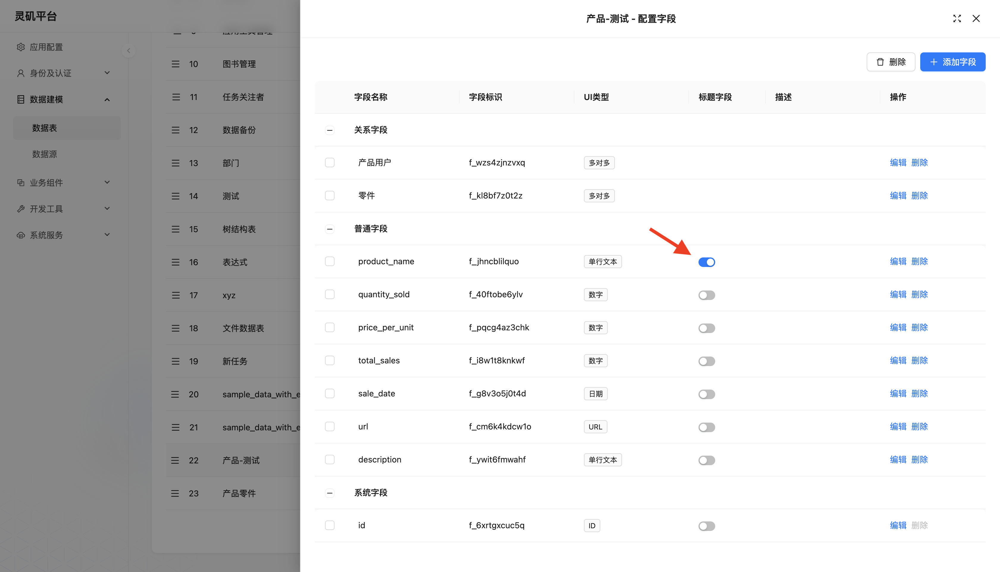
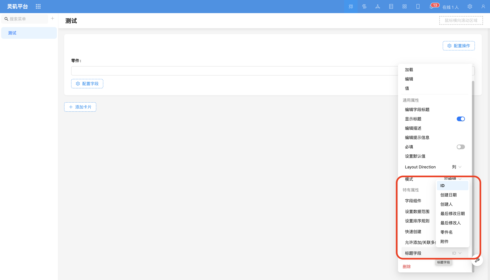

# Title Field

### Overview

Title field is commonly used in relationship field components as the relationship data identifier field displayed on the interface.

### Where Can Title Field Be Configured

#### Configure Title Field in Data Table
This configuration takes effect for the entire system.

#### Configure Title Field in Relationship Field Component
This configuration only takes effect within the current block and has the highest priority.

<!-- TODO: Add image -->
<!-- TODO: Add image -->
