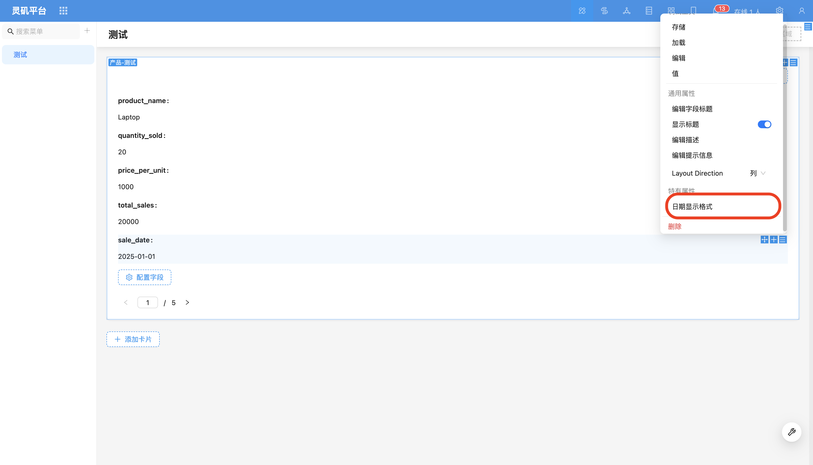
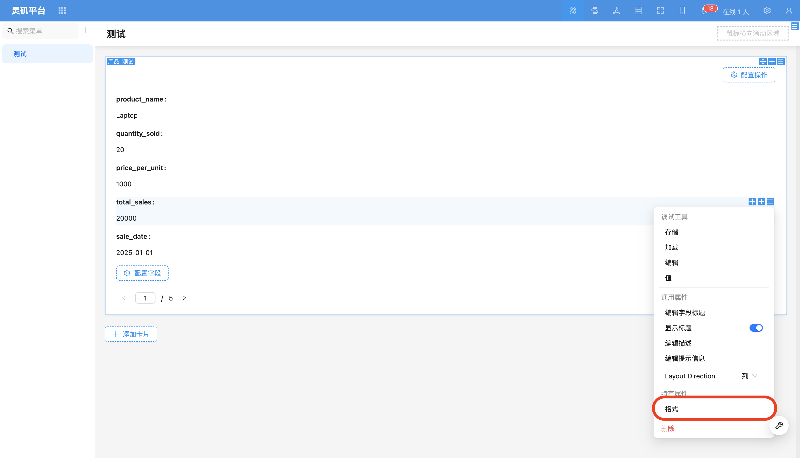
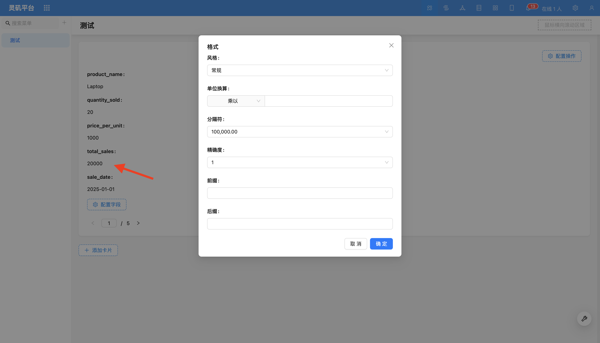

# Details Field

### Overview

The configuration items for fields in details blocks, list blocks, grid card blocks, etc. are basically the same, mainly used to control the display of fields in read mode.

### Field Configuration Items

#### Date Field Formatting

Supports customizing the format of date fields.
For more content, refer to [Date Formatting](../specific/date-picker.md).

#### Numeric Field Formatting

Supports multiple numeric display methods, including unit conversion, thousand separators, prefix/suffix, precision adjustment, and scientific notation.

For more content, refer to [Number Formatting](../field-settings/number-format.md).

- [Edit Field Title](../field-settings/edit-title.md)
- [Display Title](../field-settings/display-title.md)
- [Edit Field Description](../field-settings/edit-description.md)
- [Edit Field Tooltip](../field-settings/edit-tooltip.md)
- [Display Mode](../field-settings/pattern.md)

<!-- Field Component
Supports partial type switching to other components. For example, `URL` component can be switched to `Preview` component.

If you need to extend more components, you can refer to the relevant content of [Extending Field Components]().
Style
Form fields in read mode can set styles. -->
