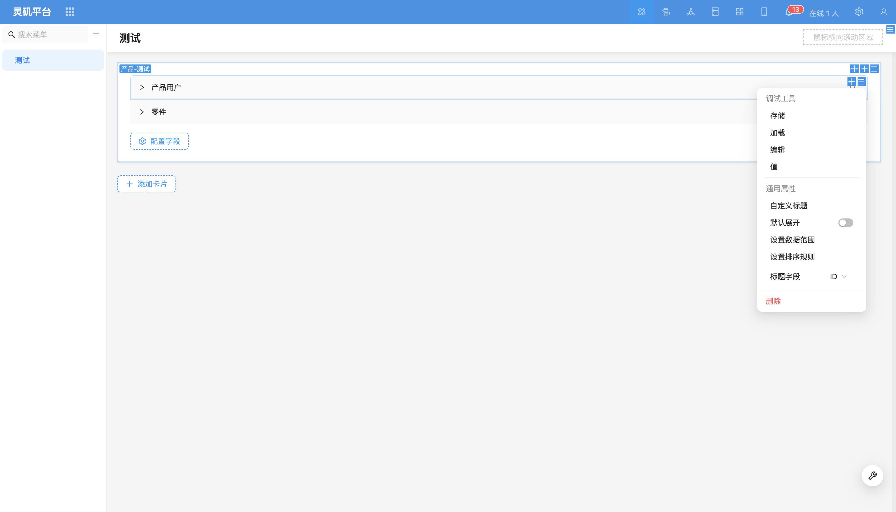
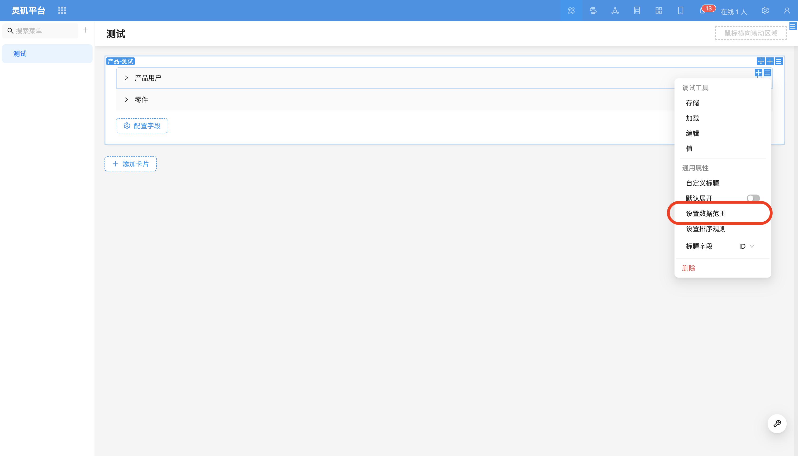
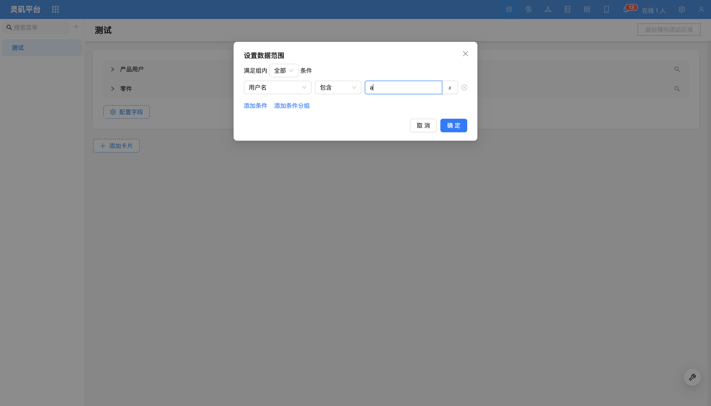
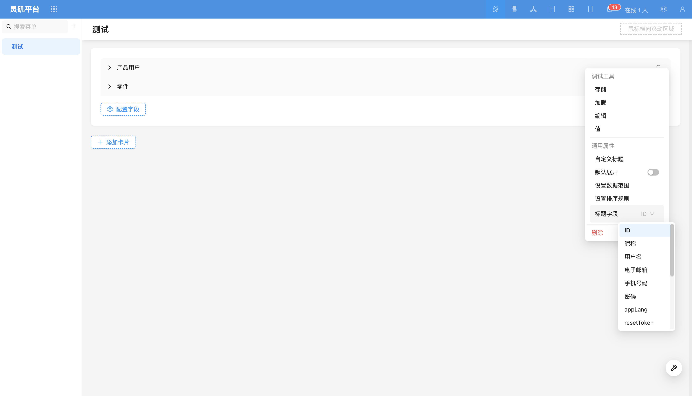

# Collapse Panel Field

### Overview

Collapse filter blocks only support selecting relationship fields and option fields as filter fields.

### Field Configuration Items

#### Set Data Scope
Configure data scope for relationship fields to limit filterable content.

Example: Filter users whose username contains 'a'.

For more content, refer to [Set Data Scope](../field-settings/data-scope.md).

#### Title Field

Configure the title field of the filter block.
For more content, refer to [Title Field](../field-settings/title-field.md).

- Default display (not expanded by default)

Set the default expanded state of the filter block, default is not expanded.

- Set sorting rules (sorting of relationship data)

Configure sorting rules for relationship data to more precisely control the order of filter results.

- Custom title

You can customize the title of the filter block.
