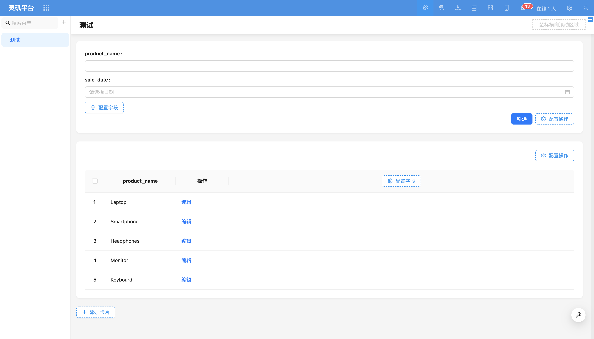
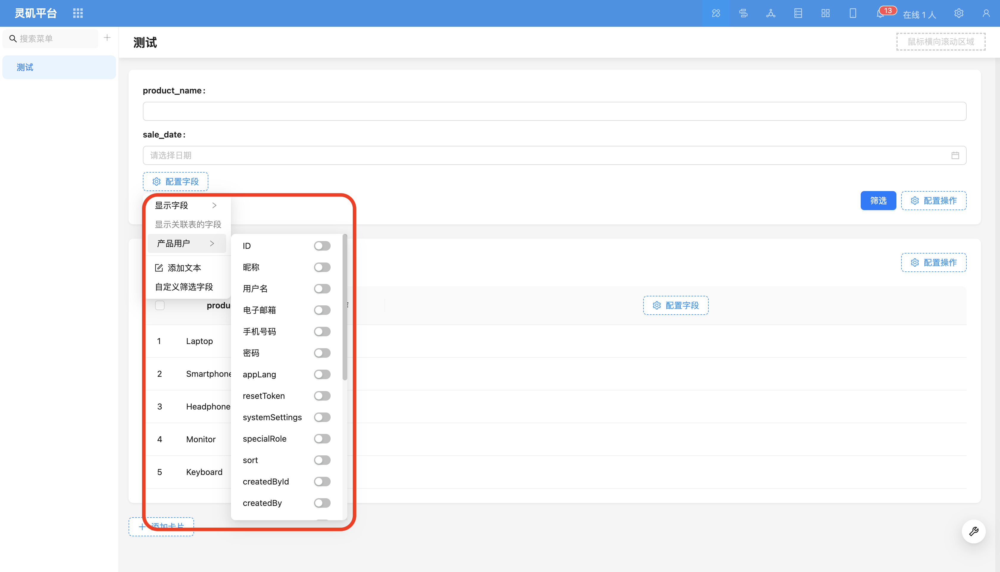
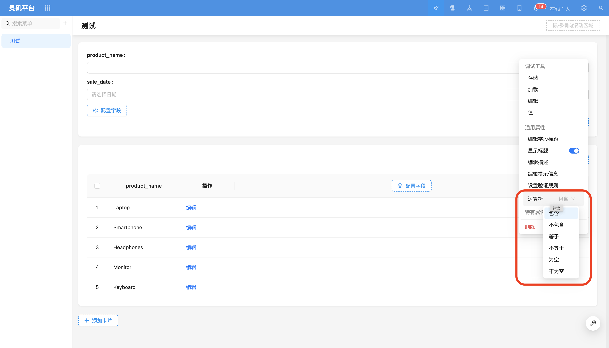
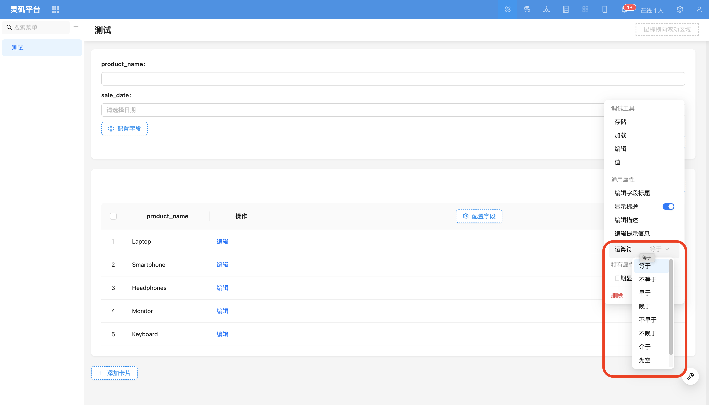

# Filter Form Field

### Overview

Filter forms support selecting current table fields and relationship table fields (i.e., relationship fields of relationships) as filter fields.

**Example**
Use fields from relationship tables as filter fields. For example, the product table and user table have a many-to-one relationship. You can configure nickname and phone number from the user table as filter fields to filter orders.

### Field Configuration Items

#### Operator

Select appropriate operators based on field type for filtering to improve filtering accuracy and efficiency. For string type fields, fuzzy matching is used by default.

- [Edit Field Title](../field-settings/edit-title.md)
- [Display Title](../field-settings/display-title.md)
- [Edit Field Description](../field-settings/edit-description.md)
- [Edit Field Tooltip](../field-settings/edit-tooltip.md)
- [Display Mode](../field-settings/pattern.md)
