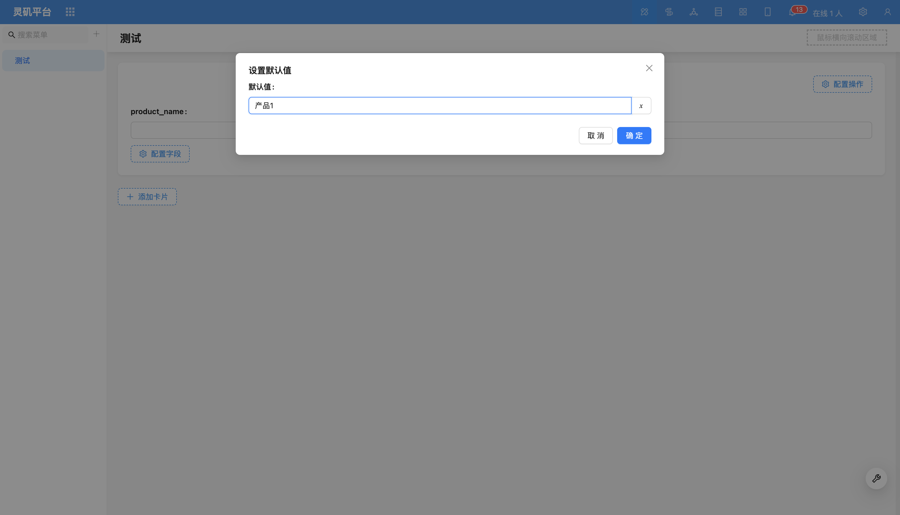
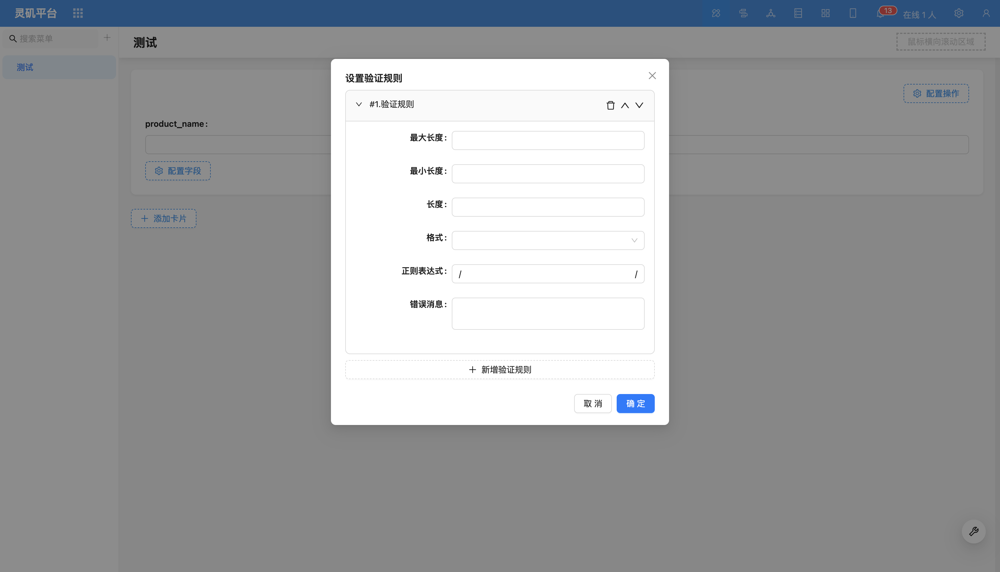

# Form Field

### Overview

In forms, different types of fields have their own unique configuration items. Users can extend field configurations through plugins to meet more customization needs.

<!-- TODO: Add image -->
<!-- TODO: Add video -->

### Field Configuration Items

#### Default Value
Supports configuring constants or variables as default values for fields.

For more content, refer to [Default Value](../field-settings/default-value.md).

#### Set Validation Rules

For more content, refer to [Set Validation Rules](../field-settings/validation-rules.md).

#### Required

For more content, refer to [Required](../field-settings/required.md).

- [Edit Field Title](../field-settings/edit-title.md)
- [Display Title](../field-settings/display-title.md)
- [Edit Field Description](../field-settings/edit-description.md)
- [Edit Field Tooltip](../field-settings/edit-tooltip.md)
- [Display Mode](../field-settings/pattern.md)

<!-- Field Component
Supports partial type switching to other components. For example, `URL` component can be switched to `Preview` component.

If you need to extend more components, you can refer to the relevant content of [Extending Field Components]().

Style
In read mode, forms support setting styles. -->
