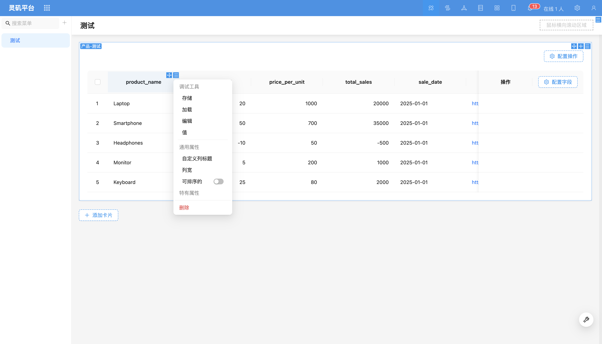
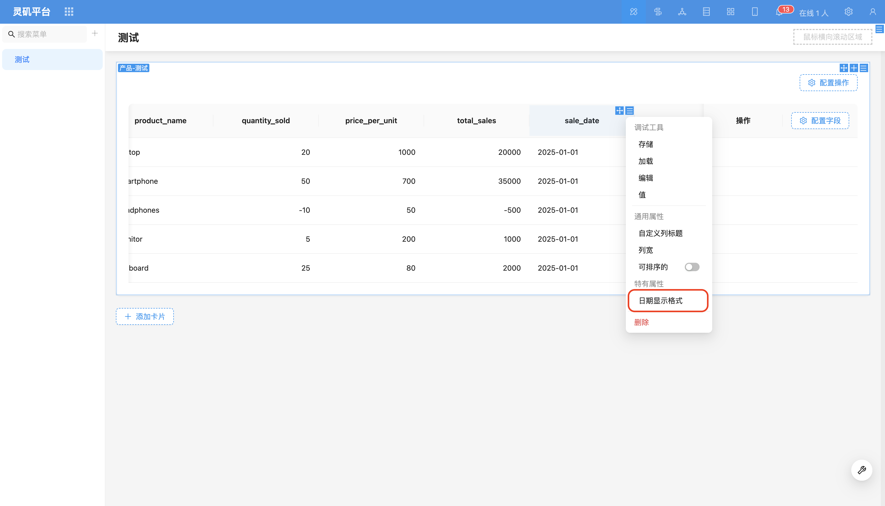
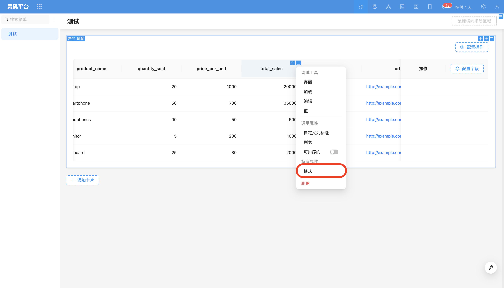
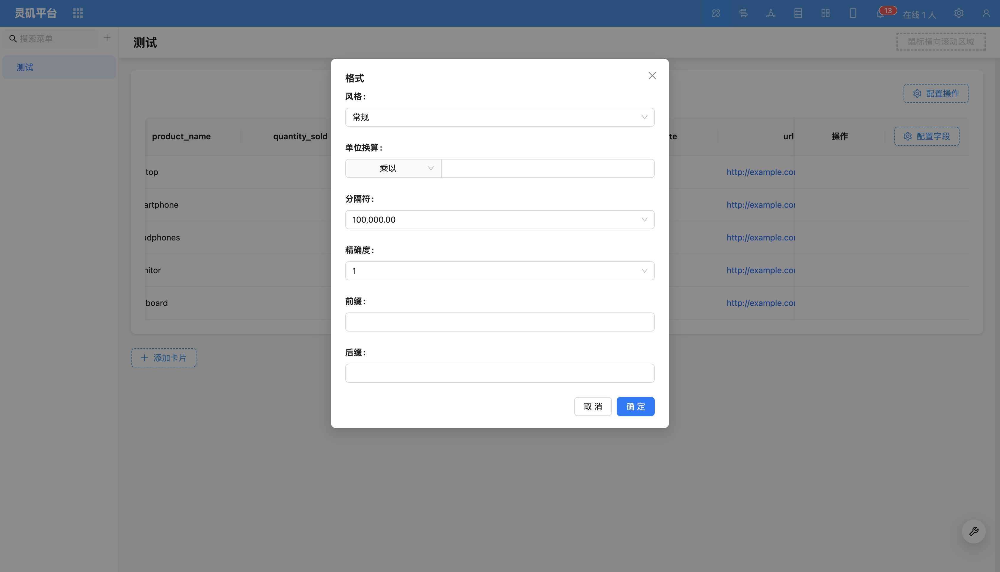
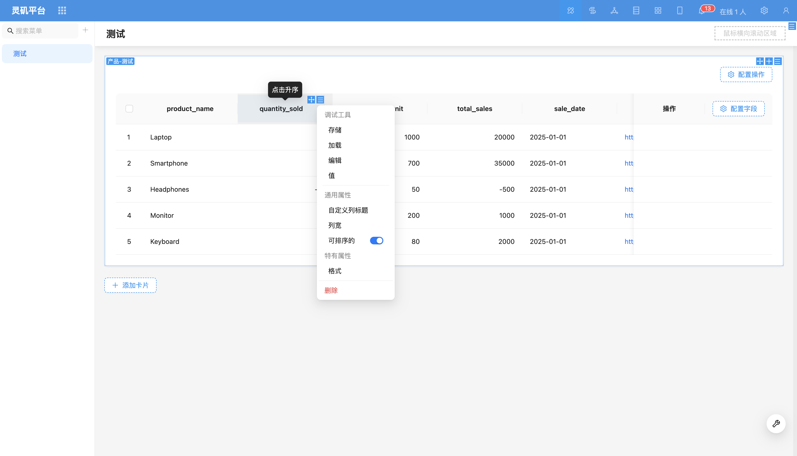

# Table Field

### Overview

Table fields not only support adjusting column width, field title, and sorting, but for certain specific fields (such as date fields, relationship fields, numeric fields), also provide more personalized display configuration options.

### Field Configuration Items

#### Date Field Formatting

For more operations, refer to [Date Formatting](../specific/date-picker.md)

#### Numeric Field Formatting

Supports simple unit conversion, thousand separators, prefix/suffix addition, precision setting, and scientific notation display.

For more operations, refer to [Number Formatting](../field-settings/number-format.md)

#### Sorting

Currently only supports sorting on a single column, and sorting only applies to data on the current page. Sorting by relationship fields is not currently supported.

<!-- Fixed Column -->

 <!-- Field Style
Supports partial type switching to other components. For example, `URL` component can be switched to `Preview` component.
If you need to extend more components, you can refer to the relevant content of [Extending Field Components](). -->

<!-- Style

Supports configuring column font color and background color based on conditions. Suppose we have a bank transaction detail table with one column being transaction amount. We want to display positive numbers (income) in green and negative numbers (expenses) in red. Specific operation steps are as follows:

1. Open the transaction amount field's settings menu and click the "Style" option.

2. Click "Add Linkage Rule" to set the first rule: when transaction amount is greater than 0, set the field color to green.

3. Click "Add Linkage Rule" again to set the second rule: when transaction amount is less than 0, set the field color to red.

The final effect is shown below: -->
