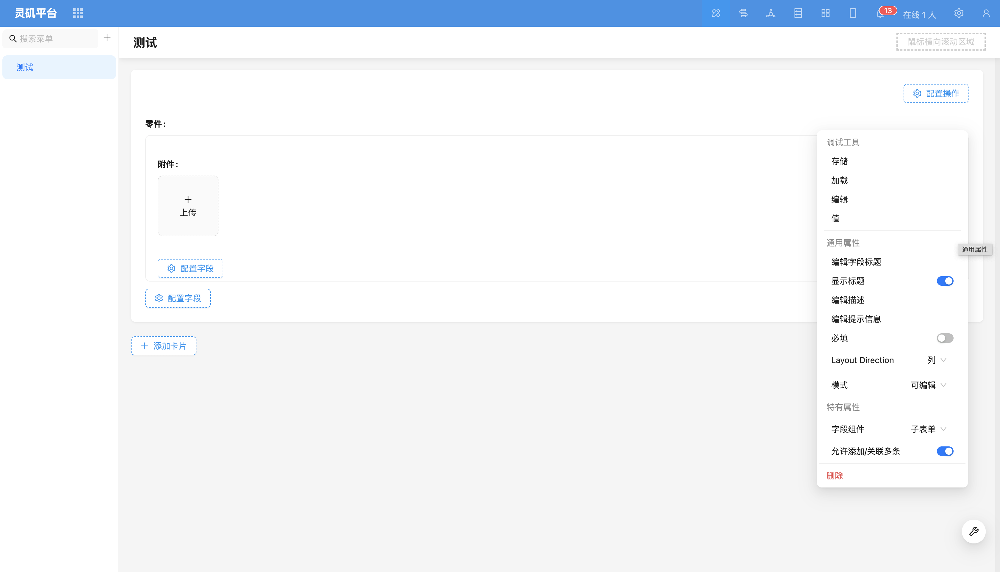
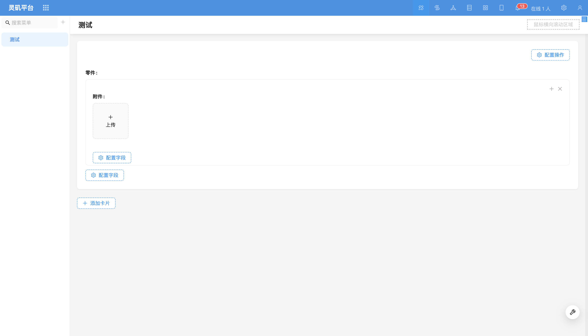

# File Manager

### Overview

File manager is a relationship field component used to handle relationship fields where the relationship target table is a file table, facilitating management and association of file data.

### Field Configuration Items

- **[Field Component](../field-settings/field-component.md)**

Supports switching to other relationship field components, such as dropdown select, data picker, etc.

- **Quick Upload (enabled by default)**

Allows directly uploading files and automatically associating them to the current record.

- **Select File (enabled by default)**

Can select from already uploaded files and associate to the current record.
