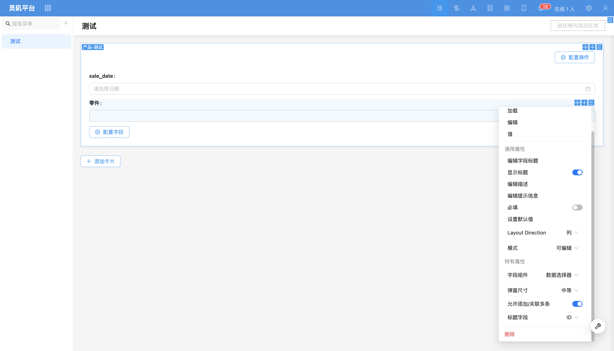
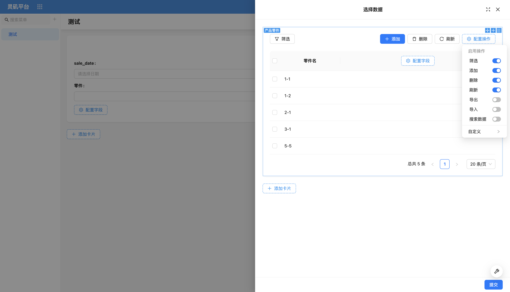
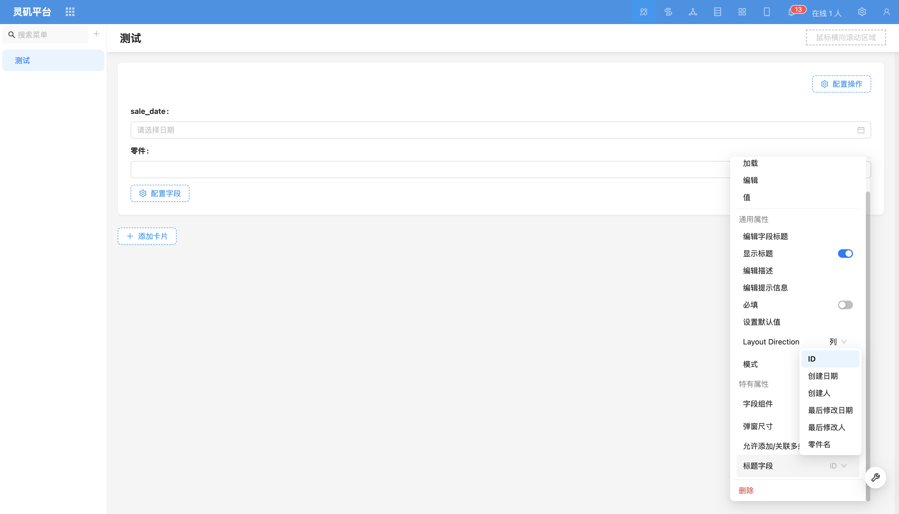

# 数据选择器

### 概述

数据选择器以弹窗表格的形式展示，支持从目标表中选择现有数据进行关联，或为目标表添加数据后进行关联。

示例：产品表有多对多关系字段「零件」。

已选中的数据不会再显示在表格选择器中。在表格选择器中，用户还可以对关系目标表进行进一步管理，如新增、删除、导入导出等。

<!-- TODO: 插入视频 -->

### 字段配置项

#### 允许添加数据
为目标表添加数据后，自动选中该数据。

<!-- TODO: 插入视频 -->

#### 允许添加/关联多条
限制对多关系数据仅允许关联一条数据。

#### 标题字段
配置标题字段，以显示在表格选择器中。

<!-- TODO: 插入视频 -->

更多内容请参考 [标题字段](../field-settings/title-field.md)。

- [弹窗尺寸](../../actions/action-settings/popup-size.md)
- [字段组件](../field-settings/field-component.md)