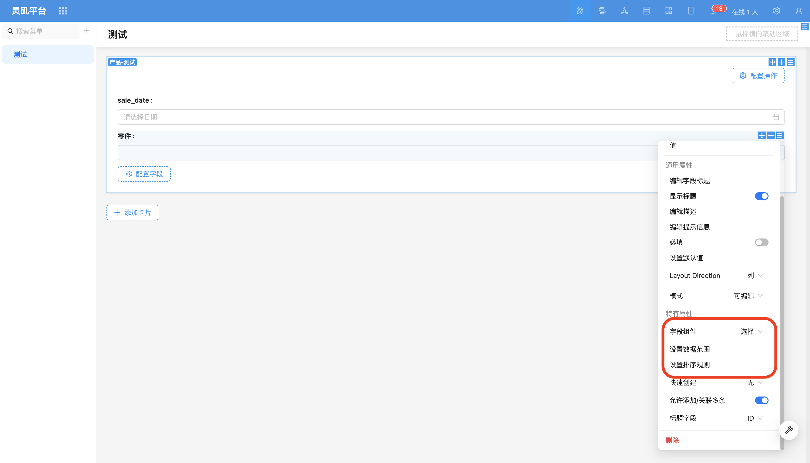
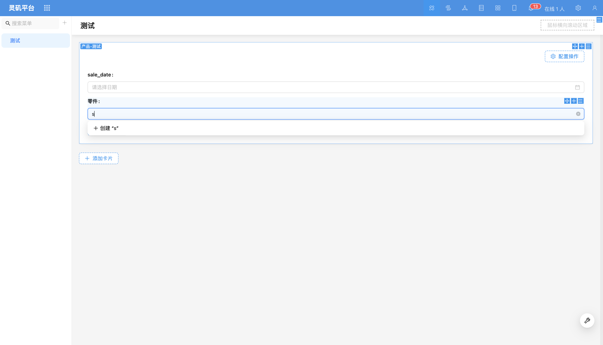
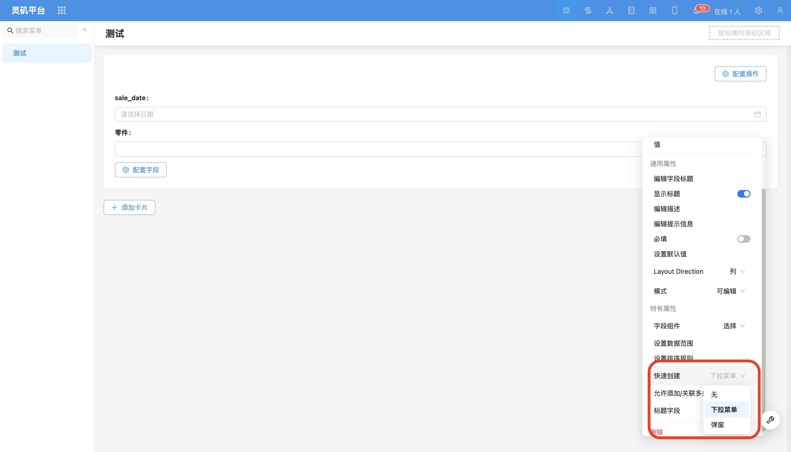
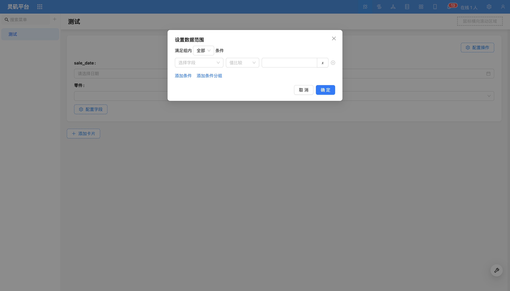
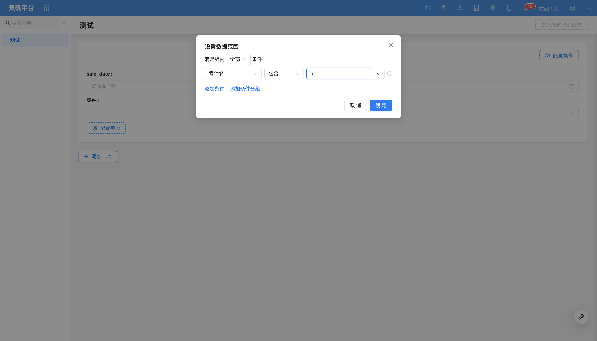
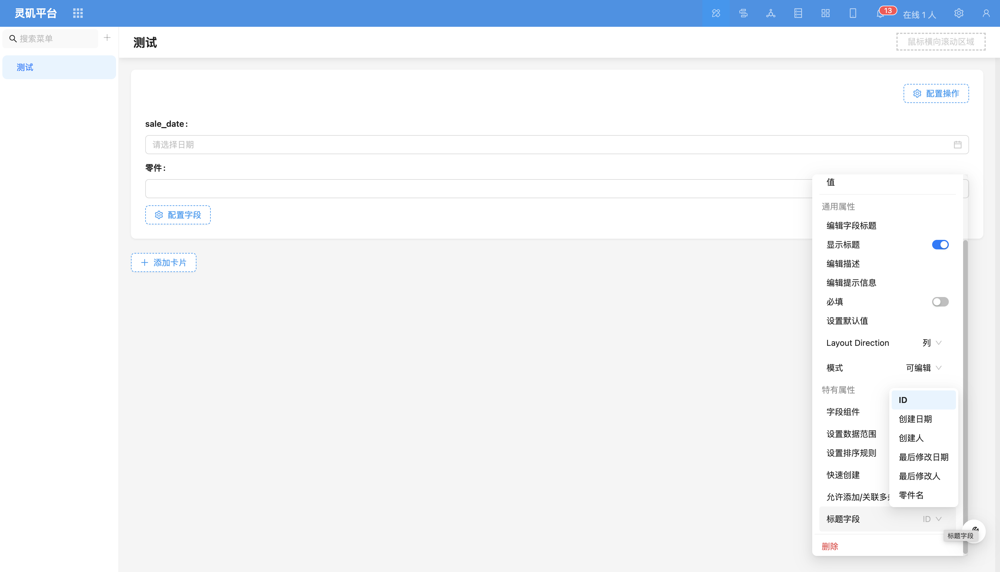

# Dropdown Selector

### Overview

Dropdown selector supports selecting associated data from existing data in the target table, or adding new data to the target table and then associating. Dropdown options support fuzzy search for quick data finding.

### Field Configuration Items

#### Quick Create
Add data first, then select that data. Suitable for simple scenarios, such as tags.
Example: Order table has many-to-one relationship field "Tags".

##### Dropdown Menu Add
After creating new data for the target table, automatically select that data and associate after form submission. Suitable for scenarios with relatively simple data.

<!-- TODO: Insert video -->

##### Popup Add
Configure create form in popup, suitable for more complex scenarios, such as product entry.
Example: Order table has many-to-many relationship field "Products".

<!-- TODO: Insert video -->

#### Set Data Scope
Control the data scope of the dropdown list.
For more content, refer to [Set Data Scope](../field-settings/data-scope.md).

#### Set Sorting Rules
Control sorting of dropdown selector data.
Example: Sort by production date in descending order.

#### Allow Add/Associate Multiple
Restrict to-many relationship data to only allow associating one data record.

#### Title Field
<!-- TODO: Insert video -->

Configure title field to display in dropdown selector.
For more content, refer to [Title Field](../field-settings/title-field.md).

[Field Component](../field-settings/field-component.md)
Supports switching to other relationship field components, such as dropdown select, data picker, etc.
