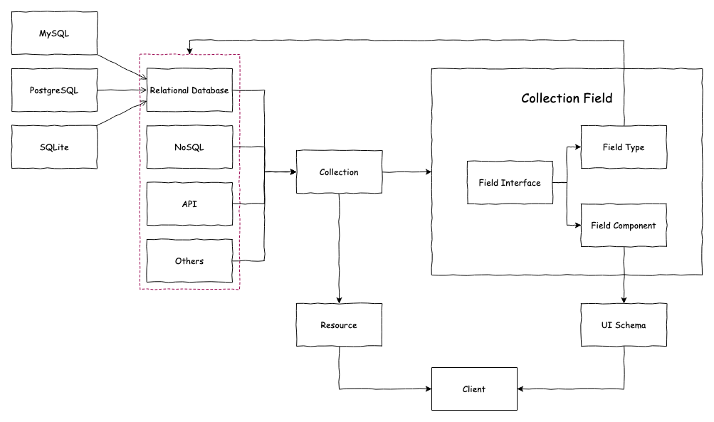

# 概述

灵矶使用了特有的领域特定语言(Domain-Specific Language)称之为**collections**，用于统一描述各种来源的数据结构，使数据管理、分析和应用更加直观和便捷。

为了快捷的的创建各种数据模型，设计了不同类型的数据表来支持:

- [普通表](./collection/general-collection.md): 标准的常用字段设置;
- [评论表](./collection/): 存储用户对内容的反馈和评论;
- [树结构表](./collection/collection-tree.md): 用于表示层级关系的数据结构，如目录或分类;
- [表达式表](./collection/workflow-dynamic-calculation.md): 用于表达工作流的动态场景;
- [日历数据表](./collection/calendar-collection.md): 用于存储日期和时间相关的事件信息;
- [文件数据表](./collection/file-collection.md): 用于管理文件的元数据，如文件名、路径和大小;
- [继承表](./collection/inheritance-collection.md): 创建一个父表，然后从父表中衍生出字表;
- [SQL数据表](./collection/sql.md): 用于存储通过 SQL 查询获取的数据;
- [外部数据表(FDW)](./collection/collection-fdw.md): 用于连接远程数据表;
- [连接数据库视图](./collection/collection-view.md): 用于提供不同数据模型间的数据视图和整合;