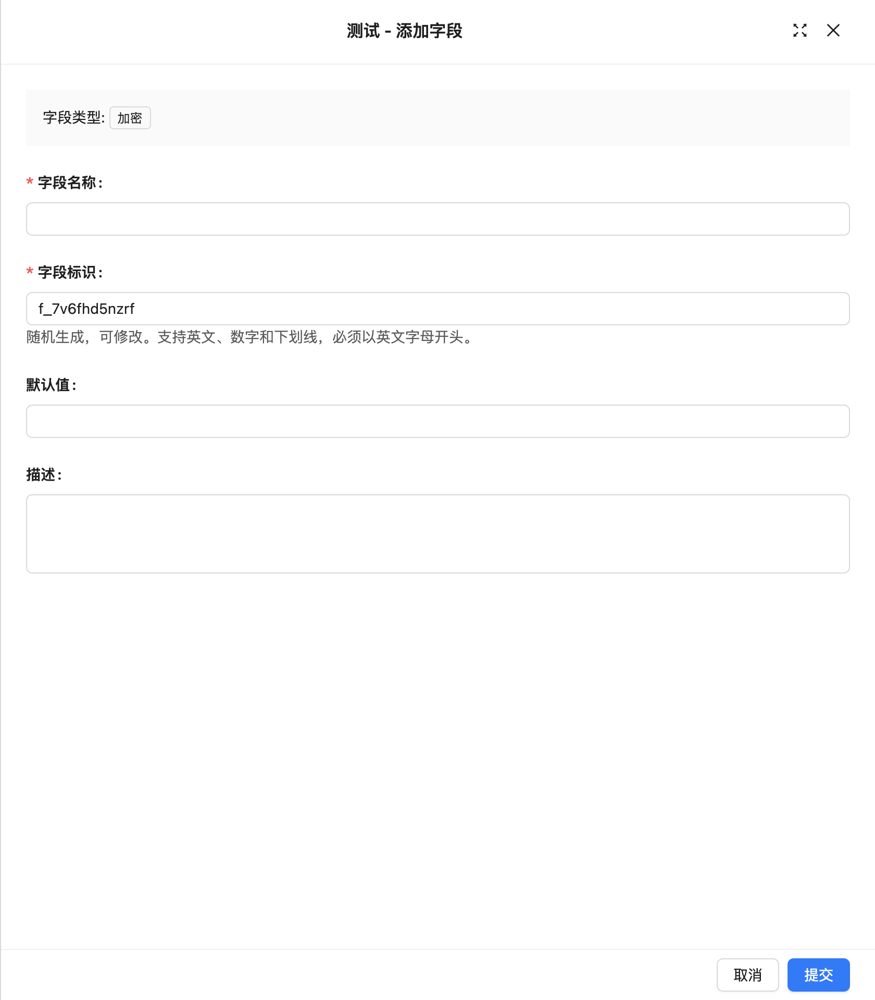

# 加密

::: info &#9432; 提示
该功能由插件 module-field-encryption 提供。
:::

### 介绍

一些敏感业务数据，如客户手机号、邮箱地址、卡号等，可以通过加密进行保护，确保加密后的数据以密文的形式存储在数据库中。

### 环境变量

::: warning &#9888; WARNING
若`ENCRYPTION_FIELD_KEY`丢失，数据将会无法解密
:::

如果需要启用加密功能，需配置 ENCRYPTION_FIELD_KEY 环境变量，该密钥应为 32 位，例如：
`ENCRYPTION_FIELD_KEY='aZ7$wLq+28VnPb&1tXkYh3m9zJ0uQwE#'`

### 字段配置

### 加密后筛选

加密后的字段只能使用等于、不等于、存在、不存在。
<!-- TODO: 插入图片 -->

### 界面配置

待补充
