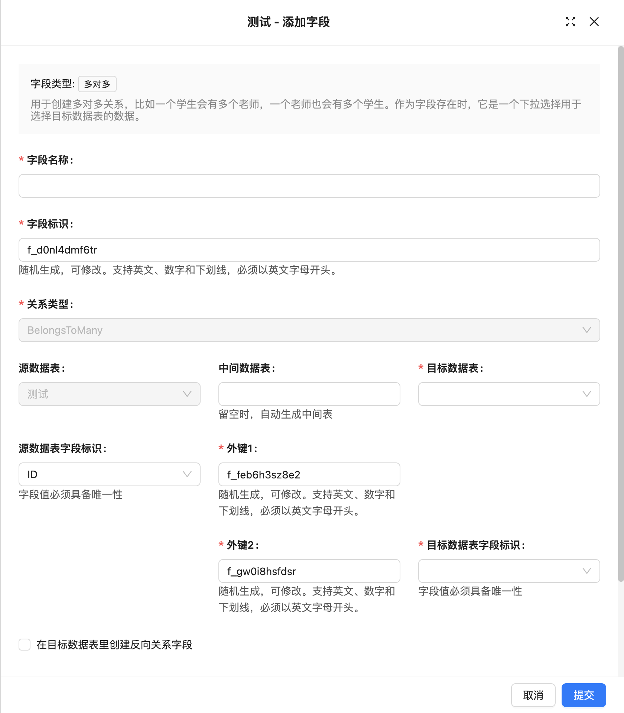

# 多对多

### 介绍

### 字段配置

### 界面配置

### 使用参数

**Source Collection**
源表，指当前字段所在的表。

**Target Collection**
目标表，指与当前表进行关联的表。

**Through Collection**
中间表，用于存储两个实体之间的多对多关系。中间表通常有两个外键，分别表示两个实体之间的关联。

**Source Key**
外键约束所引用的字段，必须具有唯一性。

**Foreign Key 1**
中间表中的字段，用于与源表建立关联。

**Foreign Key 2**
中间表中的字段，用于与目标表建立关联。

**Target Key**
外键约束所引用的字段，必须具备唯一性。

**ON DELETE**
ON DELETE 是用来定义在删除父表记录时对子表中外键引用的操作规则。常见的 ON DELETE 选项有：

- **CASCADE**：删除父表记录时，自动删除所有与之相关联的子表记录。
- **SET NULL**：删除父表记录时，将子表中相关联的外键值设为 NULL。
- **RESTRICT**：默认选项，若子表中存在关联记录，禁止删除父表记录。
- **NO ACTION**：与 RESTRICT 类似，如果子表中存在关联记录，则禁止删除父表记录。