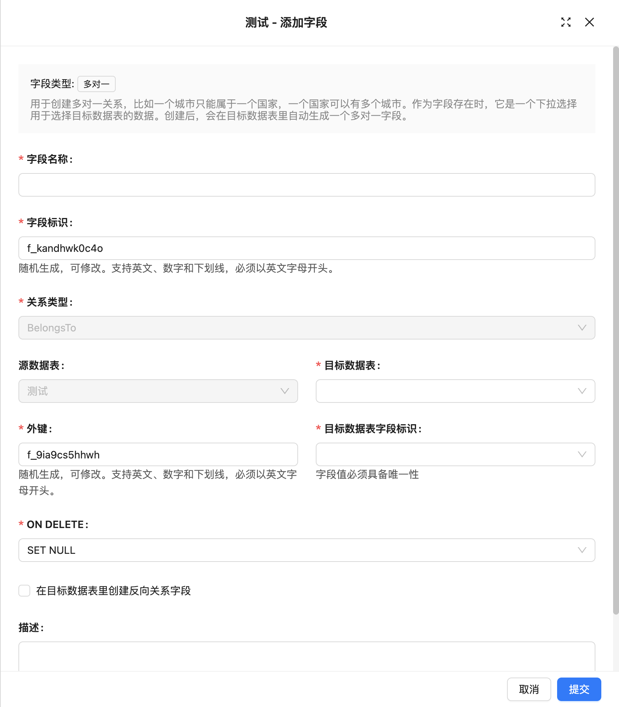

# Many-to-One

### Introduction

### Field Configuration

### Interface Configuration

### Usage Parameters

**Source Collection**
Source table, the table where the current field is located.

**Target Collection**
Target table, represents the table that establishes an association with the current table.

**Foreign Key**
Field in the source table, used to establish the relationship between the source table and the target table.

**Target Key**
Field referenced by the foreign key constraint, must be unique.

**ON DELETE**
ON DELETE is used to define the operation rules for foreign key references in child tables when deleting parent table records. Common ON DELETE options include:

**CASCADE**: When deleting a record in the parent table, automatically delete all associated records in the child table.
**SET NULL**: When deleting a record in the parent table, set the associated foreign key values in the child table to NULL.
**RESTRICT**: Default option, prohibits deletion of parent table records if associated child table records exist.
**NO ACTION**: Similar to RESTRICT, prohibits deletion of parent table records if associated child table records exist.
