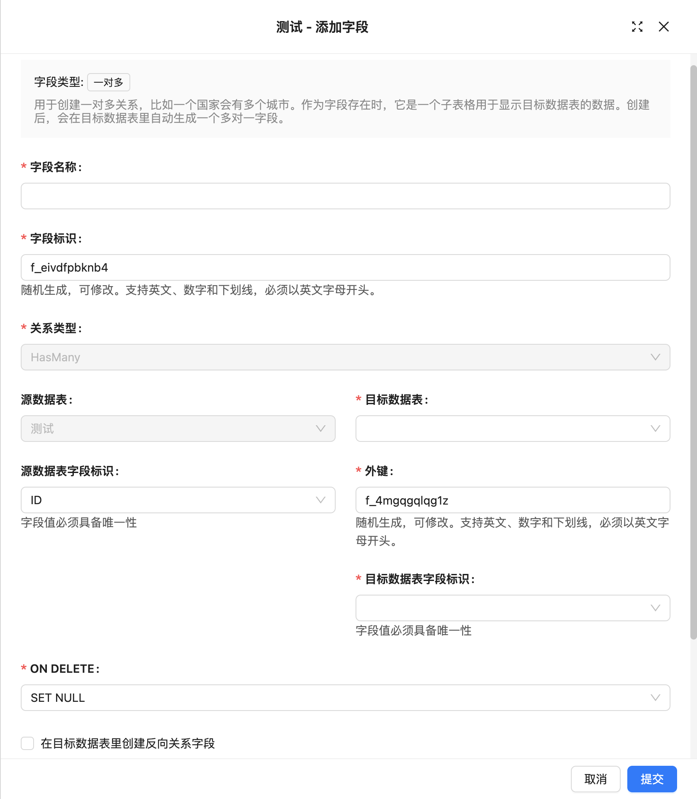

# One-to-Many

### Introduction

### Field Configuration

### Interface Configuration

### Usage Parameters

**Source Collection**
Source table, the table where the current field is located.

**Target Collection**
Target table, refers to the table that establishes an association with the current table.

**Source Key**
Field referenced by the foreign key constraint, must be unique.

**Foreign Key**
Field in the target table, used to establish an association between the two tables.

**Target Key**
Field in the target table, used to view each row of records in the relationship card, usually a unique field.

**ON DELETE**
ON DELETE is the rule for operations on foreign key references in related child tables when deleting parent table records. It is an option in the foreign key constraint definition. Common ON DELETE options include:

- **CASCADE**: When deleting a record in the parent table, automatically delete all associated records in the child table.
- **SET NULL**: When deleting a record in the parent table, set the associated foreign key values in the child table to NULL.
- **RESTRICT**: Default option, refuses to delete parent table records if associated child table records exist.
- **NO ACTION**: Similar to RESTRICT, refuses to delete parent table records if associated child table records exist.
