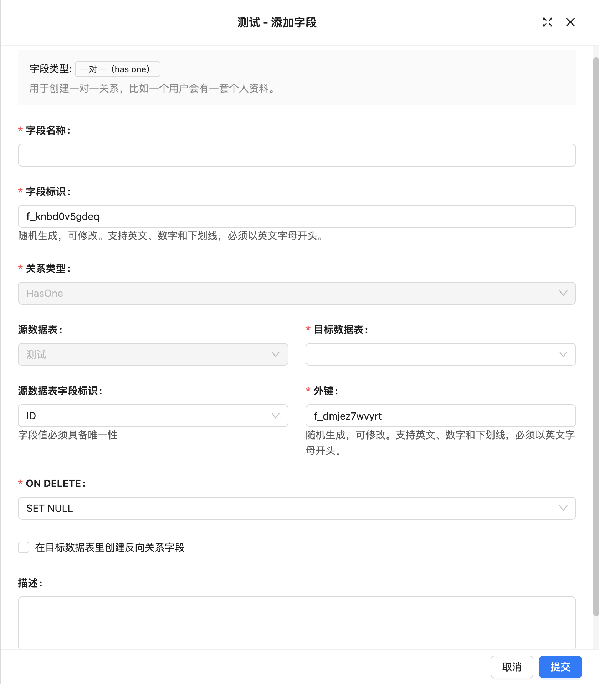

# One-to-One (has one)

### Introduction

### Field Configuration

### Interface Configuration

To be added

### Usage Parameters
#### Source Collection
Source table, refers to the table where the current field is located.

#### Target Collection
Target table, which table to associate with.

#### Foreign Key
Foreign key, used to establish an association between two tables. For a one-to-one relationship, the foreign key can be placed in either the source table or the target table. If the foreign key represents a "has a" relationship (e.g., one party owns the other in a one-to-one relationship), placing the foreign key in the target table would be more appropriate; if it represents a "belongs to" or "ownership" relationship, the foreign key should be placed in the source table.

#### Source key <- Foreign Key (foreign key in target table)
The field referenced by the foreign key constraint must be unique. When the foreign key is in the target table, it typically represents a "has one" association.

#### Target key <- Foreign Key (foreign key in source table)
The field referenced by the foreign key constraint must also be unique. When the foreign key is placed in the source table, it represents a "belongs to" or "ownership" relationship.

#### ON DELETE
ON DELETE is the operation rule for foreign key references in related child tables when deleting parent table records. It is an option when defining foreign key constraints. Common ON DELETE options include:

- **CASCADE**: When a record in the parent table is deleted, automatically delete all associated records in the child table.
- **SET NULL**: When a record in the parent table is deleted, set the associated foreign key values in the child table to NULL.
- **RESTRICT**: This is the default option. When attempting to delete a record in the parent table, if there are associated records in the child table, the deletion of the parent table record is refused.
- **NO ACTION**: Similar to RESTRICT, when associated data exists in the child table, the deletion of the parent table record is refused.
