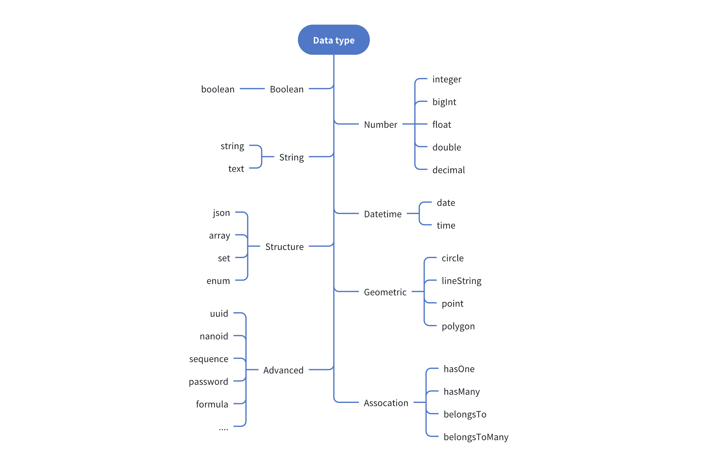
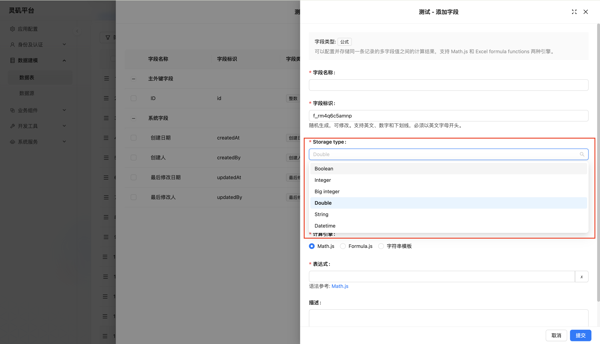

# Overview

## Data Table Fields

### Field Interface Types

From the Interface perspective, Tachybase divides fields into the following categories:

### Field Data Types
Each Field Interface has a default data type. For example, a field with Interface type Number has a default data type of double, but can also be float, decimal, etc. Currently supported data types include:

### Field Type Mapping

The process for adding new fields to the main database is:

1. Select Interface type
2. Configure available data types for the current Interface

The field mapping process for external data sources is:

1. Automatically maps external database field types to corresponding data types (Field Type) and UI types (Field Interface).
2. Can adjust to more suitable data types and Interface types as needed.
<!-- TODO: Insert image -->
