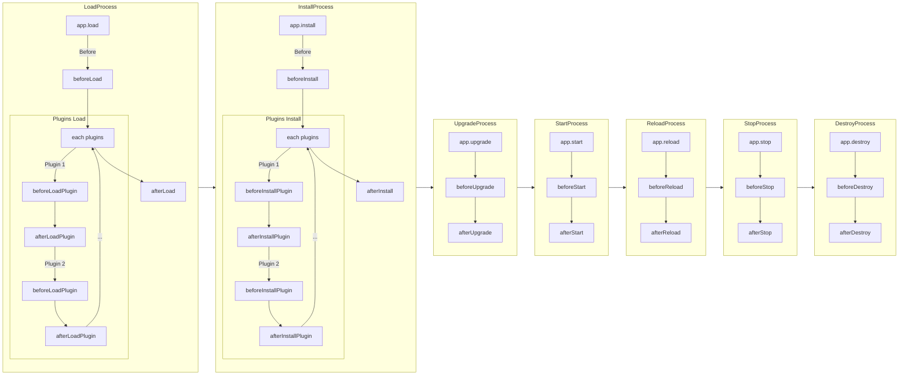
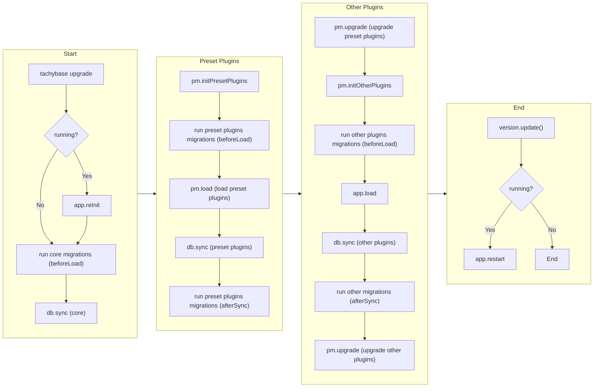

# 生命周期

应用生命周期包括以下步骤：

```mermaid
flowchart LR
    subgraph LoadProcess
        A["app.load"] -->|Before| B["beforeLoad"]
        B --> C["each plugins"]
        subgraph Plugins Load
            C -->|Plugin 1| D1["beforeLoadPlugin"]
            D1 --> E1["afterLoadPlugin"]
            E1 -->|Plugin 2| D2["beforeLoadPlugin"]
            D2 --> E2["afterLoadPlugin"]
            E2 -->|...| C
        end
        C --> F["afterLoad"]
    end

    subgraph InstallProcess
        G["app.install"] -->|Before| H["beforeInstall"]
        H --> I["each plugins"]
        subgraph Plugins Install
            I -->|Plugin 1| J1["beforeInstallPlugin"]
            J1 --> K1["afterInstallPlugin"]
            K1 -->|Plugin 2| J2["beforeInstallPlugin"]
            J2 --> K2["afterInstallPlugin"]
            K2 -->|...| I
        end
        I --> L["afterInstall"]
    end

    subgraph UpgradeProcess
        M["app.upgrade"] --> N["beforeUpgrade"]
        N --> O["afterUpgrade"]
    end

    subgraph StartProcess
        P["app.start"] --> Q["beforeStart"]
        Q --> R["afterStart"]
    end

    subgraph ReloadProcess
        S["app.reload"] --> T["beforeReload"]
        T --> U["afterReload"]
    end

    subgraph StopProcess
        V["app.stop"] --> W["beforeStop"]
        W --> X["afterStop"]
    end

    subgraph DestroyProcess
        Y["app.destroy"] --> Z["beforeDestroy"]
        Z --> AA["afterDestroy"]
    end

    %% 连接主流程
    LoadProcess --> InstallProcess
    InstallProcess --> UpgradeProcess
    UpgradeProcess --> StartProcess
    StartProcess --> ReloadProcess
    ReloadProcess --> StopProcess
    StopProcess --> DestroyProcess
```

upgrade 生命周期包括以下步骤：

```mermaid
flowchart LR
    %% 主流程
    subgraph Start
    direction TB
        A["tachybase upgrade"] --> B{running?}
        B -- Yes --> C["app.reInit"]
        B -- No --> D["run core migrations (beforeLoad)"]
        C --> D
        D --> E["db.sync (core)"]
    end

    %% 第一列：PresetPlugins
    subgraph PresetPlugins [Preset Plugins]
        G["pm.initPresetPlugins"] --> H["run preset plugins migrations (beforeLoad)"]
        H --> I["pm.load (load preset plugins)"]
        I --> J["db.sync (preset plugins)"]
        J --> K["run preset plugins migrations (afterSync)"]
    end

    %% 第二列：OtherPlugins
    subgraph OtherPlugins [Other Plugins]
        L["pm.upgrade (upgrade preset plugins)"] --> M["pm.initOtherPlugins"]
        M --> N["run other plugins migrations (beforeLoad)"]
        N --> O["app.load"]
        O --> P["db.sync (other plugins)"]
        P --> Q["run other migrations (afterSync)"]
        Q --> R["pm.upgrade (upgrade other plugins)"]
    end

    %% 版本更新流程
    subgraph End
        T["version.update()"] --> U{running?}
        U -- Yes --> V["app.restart"]
        U -- No --> W["End"]
    end

    Start --> PresetPlugins
    PresetPlugins --> OtherPlugins
    OtherPlugins --> End
```
