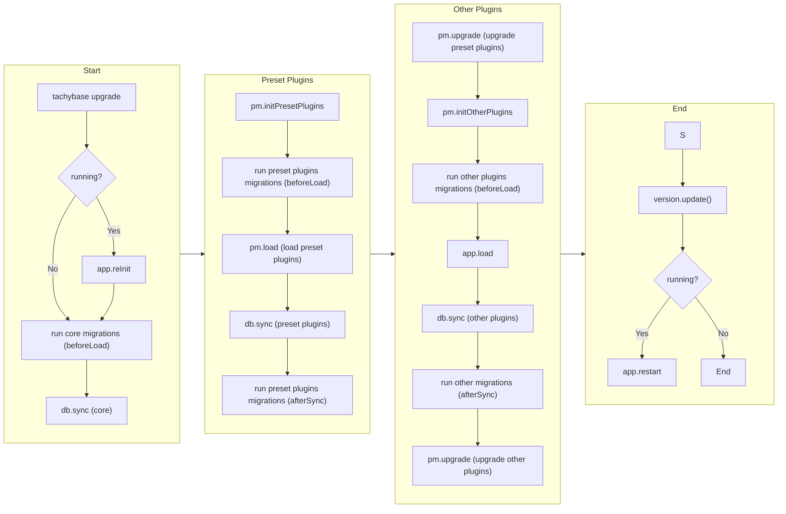

# 生命周期

```mermaid
flowchart LR
    %% 主流程
    subgraph Start
    direction TB
        A["tachybase upgrade"] --> B{running?}
        B -- Yes --> C["app.reInit"]
        B -- No --> D["run core migrations (beforeLoad)"]
        C --> D
        D --> E["db.sync (core)"]
    end

    %% 第一列：PresetPlugins
    subgraph PresetPlugins [Preset Plugins]
        G["pm.initPresetPlugins"] --> H["run preset plugins migrations (beforeLoad)"]
        H --> I["pm.load (load preset plugins)"]
        I --> J["db.sync (preset plugins)"]
        J --> K["run preset plugins migrations (afterSync)"]
    end

    %% 第二列：OtherPlugins
    subgraph OtherPlugins [Other Plugins]
        L["pm.upgrade (upgrade preset plugins)"] --> M["pm.initOtherPlugins"]
        M --> N["run other plugins migrations (beforeLoad)"]
        N --> O["app.load"]
        O --> P["db.sync (other plugins)"]
        P --> Q["run other migrations (afterSync)"]
        Q --> R["pm.upgrade (upgrade other plugins)"]
    end

    %% 版本更新流程
    subgraph End
        S --> T["version.update()"]
        T --> U{running?}
        U -- Yes --> V["app.restart"]
        U -- No --> W["End"]
    end

    Start --> PresetPlugins
    PresetPlugins --> OtherPlugins
    OtherPlugins --> End
```
