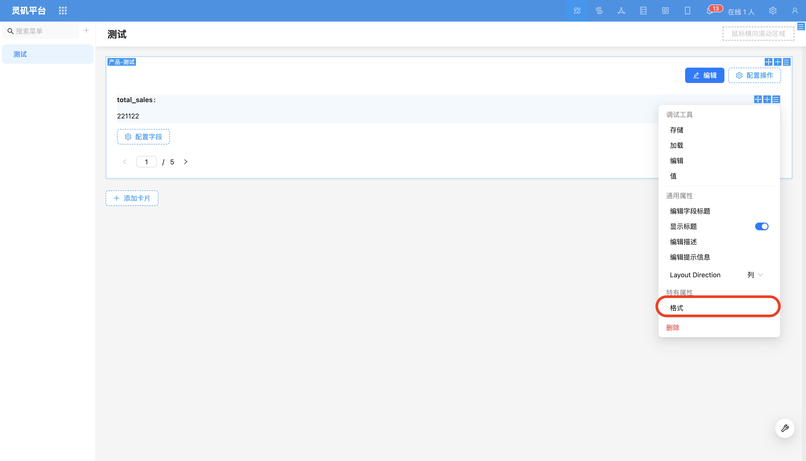
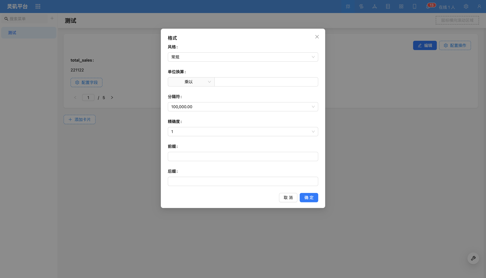
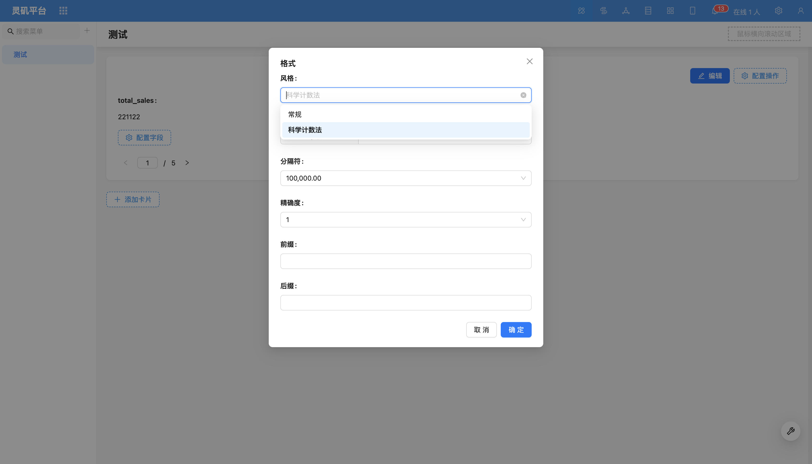

# 数值格式化

### 概述

**数值格式化**用于在阅读模式下美化和规范**数值类型字段**（包括**公式字段**），增强数据的可读性。

## 使用说明
支持单位转换、千分位分隔符、小数位精度、前后缀、科学计数法等功能。

- 示例
例如，可以对订单金额进行格式化，添加人民币符号（`￥`）、千分位分隔符（如逗号或点号）以及调整小数位数，使其更易于阅读。

<!-- TODO: 添加视频 -->

还可以选择使用科学计数法来表示数据。

