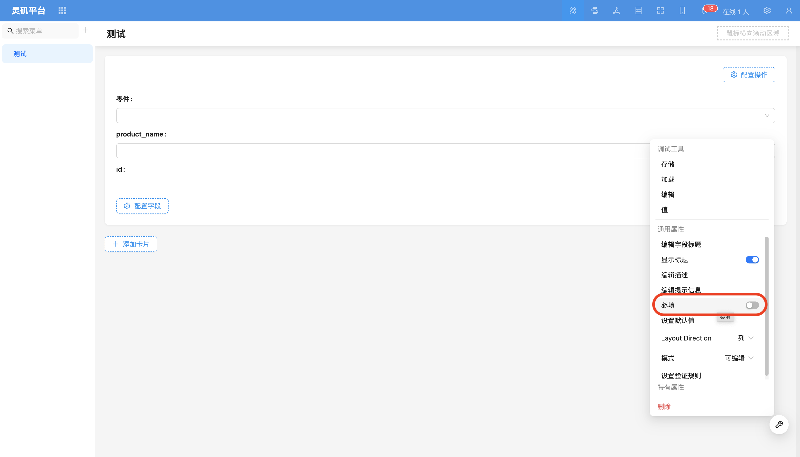
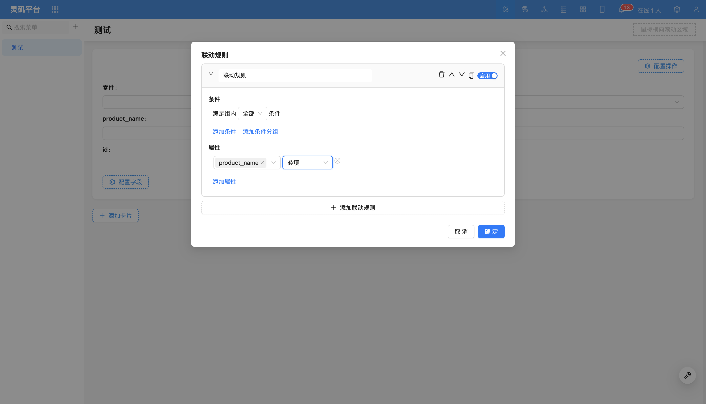

# 必填

### 概述

必填是表单验证中的常见规则，用户可以在字段配置项中直接启用，或者通过表单的联动规则动态设置字段为必填。

### 设置方式

#### 静态必填（直接设置）
适用于所有情况下都必须填写的字段，例如：
用户名
密码
手机号

#### 动态必填（条件必填）
通过表单的联动规则，根据特定条件动态设置必填。

示例：

无论怎么样，要求填写“产品名称”。
这种方式适用于需要灵活控制字段必填逻辑的场景。

<!-- TODO: 添加视频 -->
