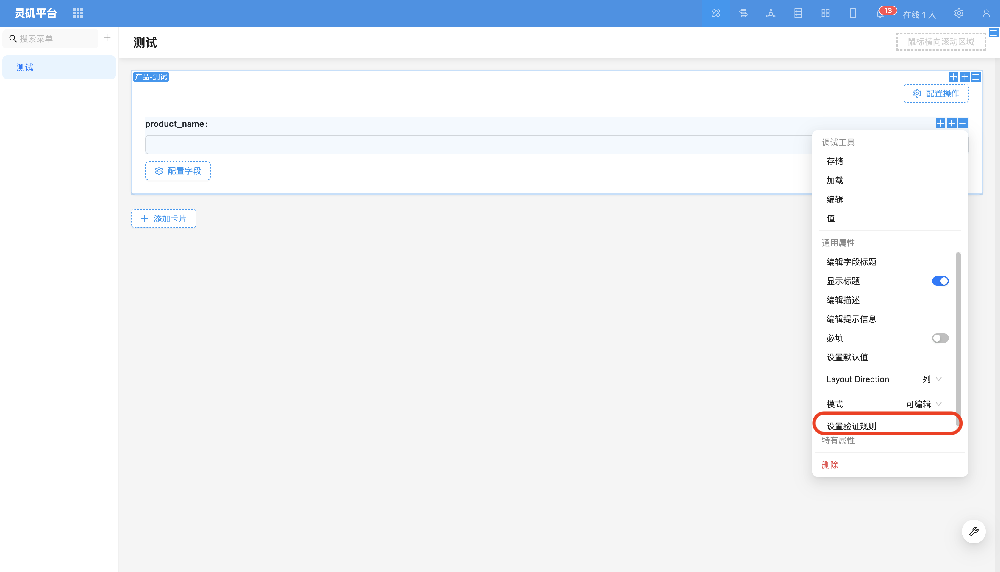
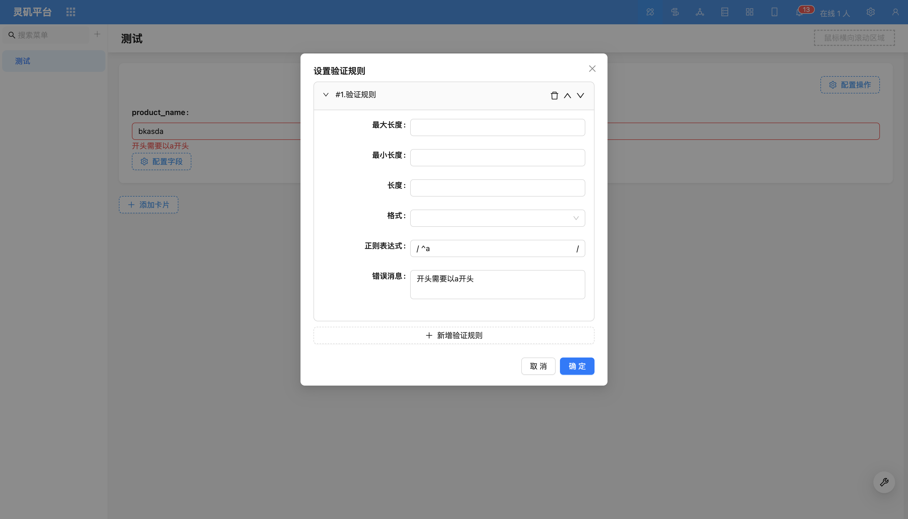
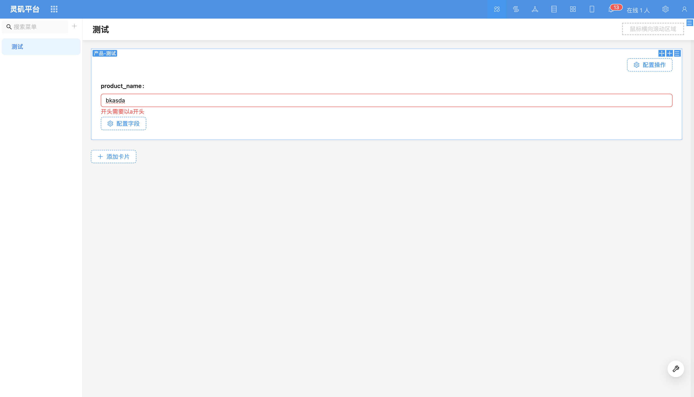

# 设置验证规则

### 概述

设置验证规则用于确保用户输入的数据符合预期要求。系统提供了预置格式校验，同时支持用户自定义规则。

预置格式校验
系统内置了常见的数据格式校验，包括：

数值（整数、小数）
身份证号码
邮箱
手机号

#### 长度/大小校验
支持对数值字段设置最小值/最大值限制。
(目前仅支持常量，不支持变量。)

<!-- TODO: 添加视频 -->

#### 自定义正则校验
如果预置规则无法满足需求，可以使用正则表达式（Regex）进行自定义校验。
可以设置校验规则，并自定义错误提示信息。

示例：
校验用户名只能以`a`开头：

