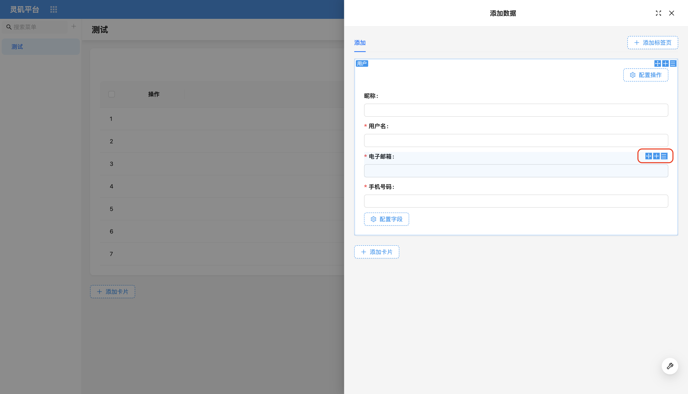

# 字段

在用户界面设计中，**字段组件**是数据的主要承载体。不同类型的数据通过不同的字段组件进行呈现和展示。需要注意，字段不能单独存在，必须依附于**区块**内才能正常使用。

### 区块中的字段

字段通常不会单独使用，而是作为数据类型区块中的子元素存在。每个数据类型区块通常都会包含“配置字段”，而这些字段的列表则由当前的数据表提供。

### 字段设计器（工具栏）
与区块类似，字段组件的右上角同样配备了三个功能图标，分别是：

- 拖拽布局
- 快速添加字段
- 字段参数配置

### 字段布局

可以通过拖拽的方式，灵活地自定义调整字段在区块中的位置和排列。

<!-- TODO: 插入视频 -->

<!-- 字段组件
支持部分类型切换为其他组件。例如，`URL` 组件可以切换为 `Preview` 组件。
如果需要扩展更多的组件，可以参考[扩展字段组件]()的相关内容。 -->