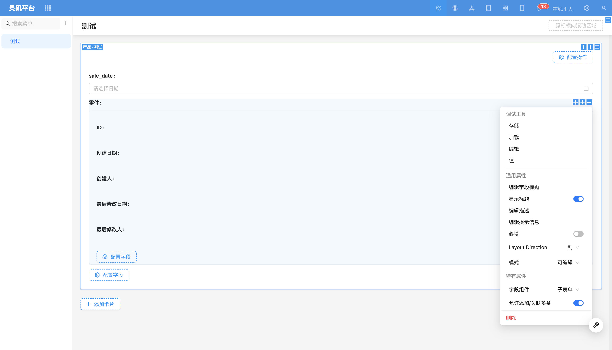
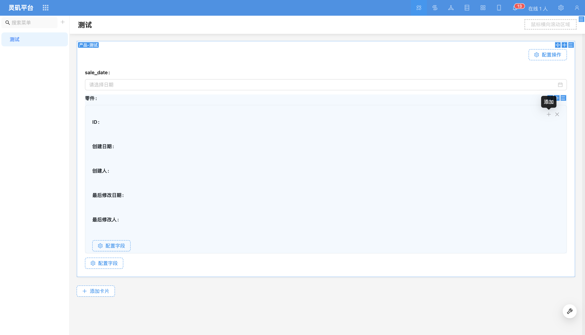

# 子表单

### 概述

子表单适用于先创建关系数据后进行关联的场景。多层级的关系数据通过嵌套表单形式清晰展示。与数据选择器和下拉选择器不同，子表单可以直接在当前页面的卡片中维护关系表字段，且关系数据与主表一起提交。

### 使用说明

1. 对多关系字段子表单
<!-- TODO: 插入图片 -->
支持多层关系字段的嵌套显示，例如产品和零件。

2. 对一关系字段子表单
适用于一对一的关系字段配置。
<!-- TODO: 插入图片 -->

### 字段配置项
#### 允许添加/关联多条（默认开启）
开启此功能后，用户可以通过点击“+”号添加多条记录。

#### 字段组件
支持切换为其他关系[字段组件](../field-settings/field-component.md)，例如下拉选择、数据选择器等。

#### 联动规则
<!-- TODO: 插入视频 -->

可以配置[联动规则](../../block/block-settings/linkage-rule.md)，以便根据条件触发其他字段的变动。
