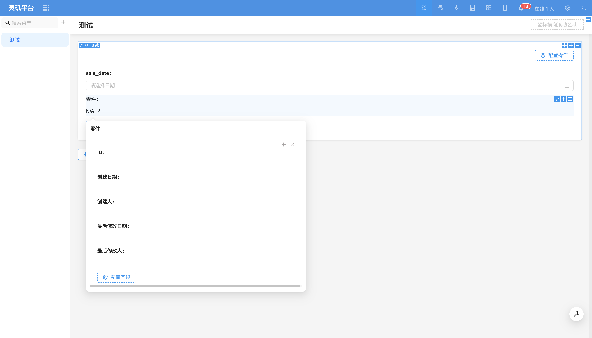
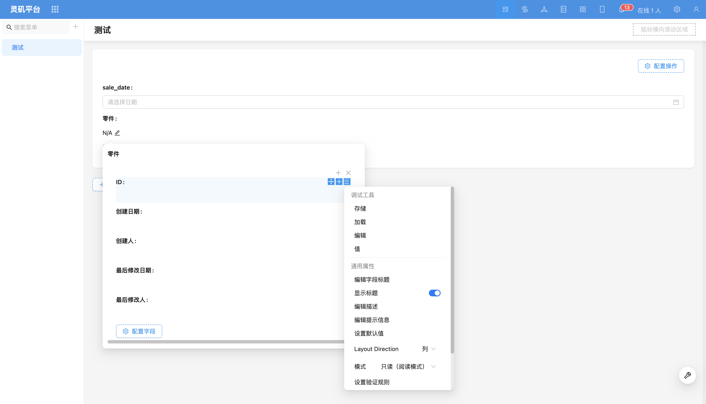
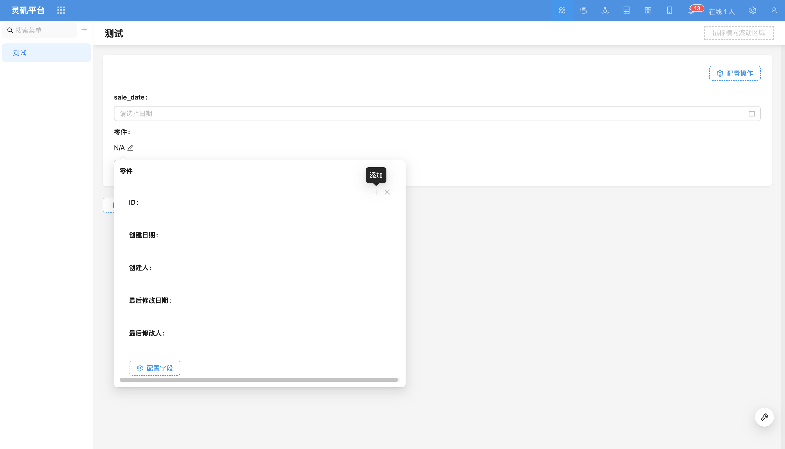

# 子表单（弹窗）

### 概述

对于关系层级复杂、字段众多的关系表，子表单布局可能难以有效呈现数据的主次关系。在这种情况下，子表单（弹窗）将关系字段子表单以弹窗形式显示，提供更加清晰的展示。

### 使用说明

#### 在子表格中使用
通过子表格嵌入子表单，支持复杂关系的数据展示。

#### 在表单卡片中使用
在表单卡片内以弹窗形式展示子表单，适用于需要清晰展现数据层级的场景。

<!-- TODO: 插入图片 -->

### 字段配置项
#### 标题字段

<!-- TODO: 插入图片 -->

弹窗外实时显示标题字段的值，帮助用户理解数据内容。

<!-- TODO: 插入图片 -->

#### 允许添加/关联多条（默认开启）
默认情况下，允许通过点击“+”号添加多条记录。
关闭此功能时，只能添加或关联一条数据。

#### 字段组件
支持切换为其他关系[字段组件](../field-settings/field-component.md)，如下拉选择、数据选择器等。

#### 联动规则
可以配置[联动规则](../../block/block-settings/linkage-rule.md)，以便根据条件触发其他字段的变动。

<!-- TODO: 插入视频 -->
