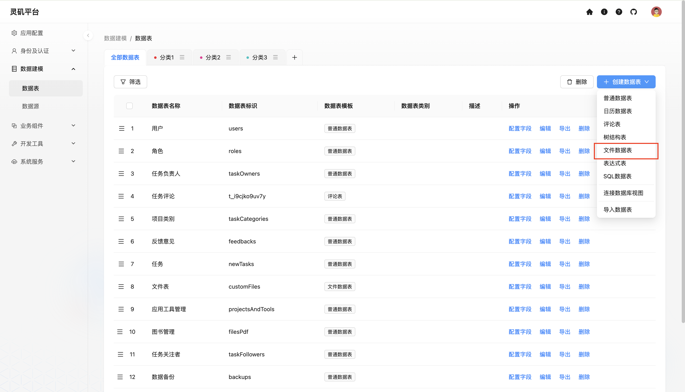
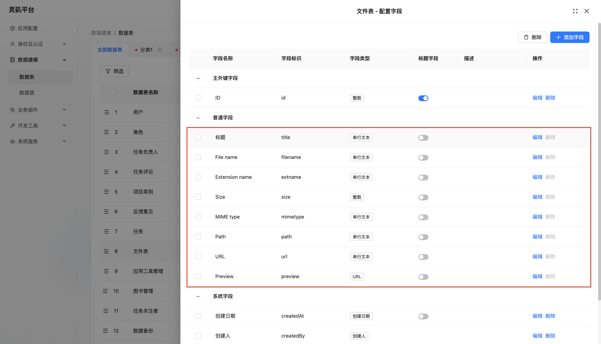
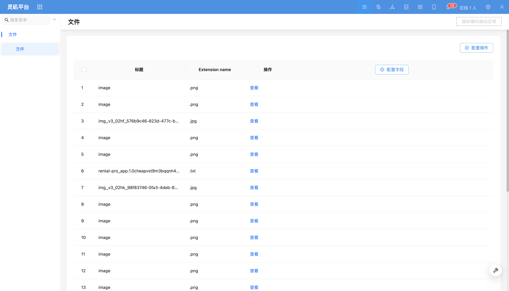
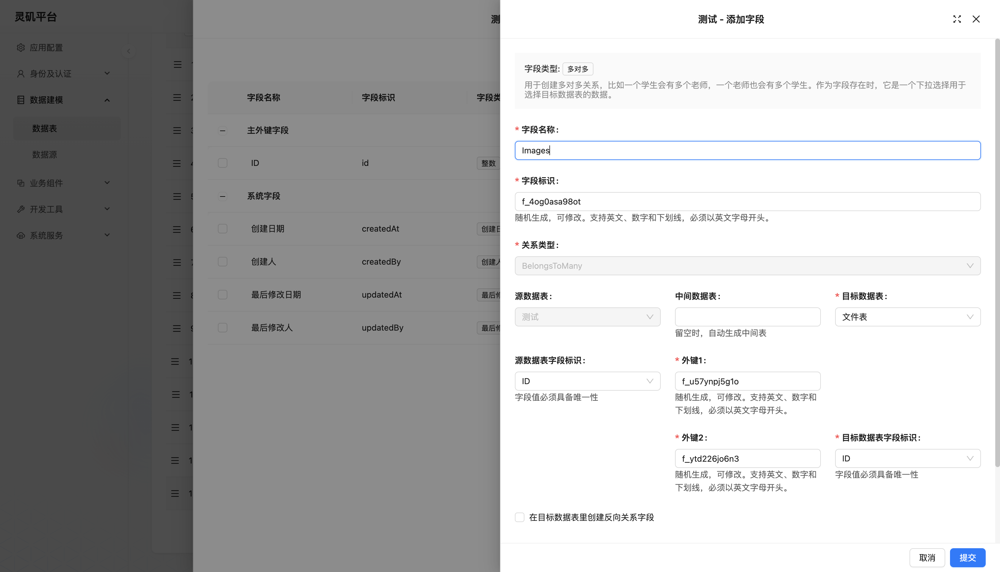

# 文件数据表

::: info &#9432; 提示
该功能由插件 module-file 提供。
:::

### 介绍
文件是记录在特定结构的数据表中，这种数据表被称为**文件表**，用于存储文件的元数据，例如文件名、路径和大小等信息，并可以通过文件管理器进行管理。

### 使用手册
创建文件夹

文件表预置字段

在卡片中使用

关系字段

关系字段使用
<!-- TODO: 插入图片 -->
