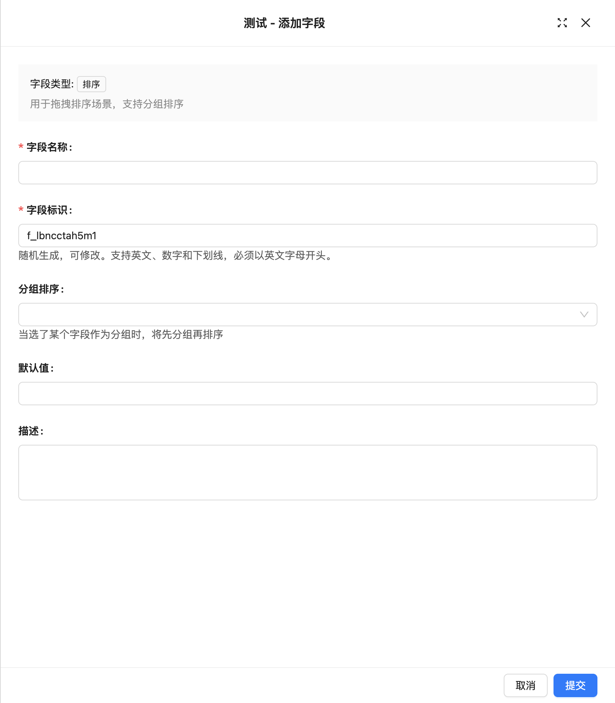

# 排序字段

### 介绍

**排序字段**用于对数据表中的记录进行排序，并支持先进行分组，再进行排序（如 sort1）。

::: warning &#9888; WARNING
由于排序字段属于同一张表的字段，因此在分组排序的情况下，不能将同一条记录同时分配到多个组中。
:::

### 界面配置

在创建排序字段时，系统会对排序值进行初始化：

- 如果未启用分组排序，排序值将根据主键字段和创建日期字段进行初始化。
- 如果启用了分组排序，系统会先对数据进行分组，然后根据主键字段和创建日期字段来初始化排序值。

::: warning &#9888; WARNING
事务一致性说明:

- 在创建字段时，如果排序值初始化失败，则该排序字段将不会被创建。
- 当某个记录在指定范围内从位置 A 移动到位置 B 时，A 到 B 区间内的所有记录的排序值都会被更新。如果其中某一条记录的排序值更新失败，则整个移动操作将会失败，相关记录的排序值也不会被更新。

:::

#### 创建sort_1字段
<!-- TODO: 插入图片 -->

sort字段无分组



各记录的排序字段会根据主键字段和创建日期字段进行初始化：

<!-- TODO: 插入图片 -->

#### 创建一个根据Class ID分组的sort_2字段

<!-- TODO: 插入图片 -->

此时会对数据表中的全部记录先分组(按Class ID分组), 在对排序字段(sort_2)排序:

<!-- TODO: 插入图片 -->

#### 拖拽排序

排序字段主要用于对各区块记录进行拖拽排序，目前支持的拖拽排序区块包括表格和看板。

::: warning &#9888; WARNING

1. 同一排序字段在多个区块中混用可能会影响现有的排序规则。
2. 表格拖拽排序时，不能选择带有分组规则的排序字段。
3. 例外：在一对多关系的表格区块中，外键字段可以作为分组字段。
4. 目前，只有看板区块支持分组排序的拖拽操作。

:::

##### 表格行的拖拽排序

表格区块

<!-- TODO: 插入图片 -->

关系表格区块

<!-- TODO: 插入视频 -->

::: warning &#9888; WARNING

一对多关系区块的排序规则

- 如果选择的是未分组的排序字段，那么所有记录都有可能参与排序。
- 如果基于外键进行分组排序，排序规则仅会影响当前分组内的数据。

虽然最终排序结果一致，但参与排序的记录数可能不同。

:::

##### 看板卡片的拖拽排序

<!-- TODO: 插入图片 -->

#### 排序规则说明

未分组（或同组）元素之间的移动
假设有一组数据：

`[1, 2, 3, 4, 5, 6, 7, 8, 9]`

当元素 7 向前移动到 4 的位置时，只有 4, 5, 6, 7 的序号会发生变化。7 占用了 4 的位置，4、5、6 各自向后移动一个位置。

`[1, 2, 3, 7, 4, 5, 6, 8, 9]`

然后，继续将 8 向后移动到 6 的位置，8 占用了 6 的位置，5 和 6 各自向前移动一个位置。

`[1, 2, 3, 7, 4, 5, 8, 6, 9]`

不同分组之间的元素移动
在分组排序时，如果一条记录移动到其他组，它所在的组也会发生变化。例如，以下示例：

```
组 A: [1, 2, 3, 4]
组 B: [5, 6, 7, 8]
```

当 3 移动到 6 的位置时（假设默认放在后面），3 所在的组会从 A 变为 B：

```
组 A: [1, 2, 4]
组 B: [5, 6, 3, 7, 8]
```

排序变更与界面显示的数据
例如，假设有一组数据：

`[1, 2, 3, 4, 5, 6, 7, 8, 9]`

但界面只显示了：

`[2, 6, 9]`

当 2 移动到 9 的位置时，尽管中间的数据（3, 4, 5, 6, 7, 8）的位置发生变化，界面依然显示：

`[6, 9, 2]`

