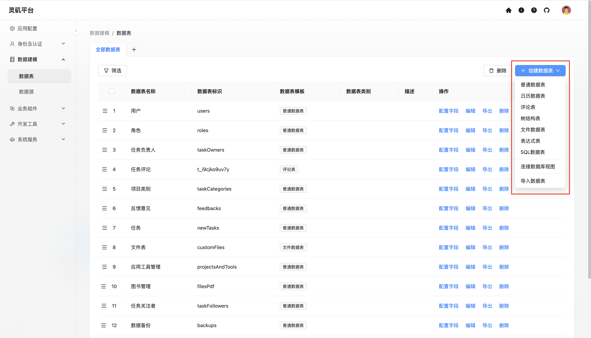
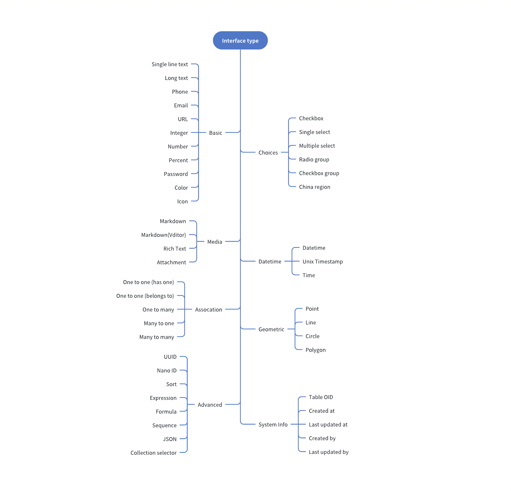

# 概述
数据建模是数据管理和系统设计的核心环节，通过对数据进行结构化处理，不仅能够优化系统性能、提升可维护性，还能促进不同系统之间的无缝集成，为数据管理和系统设计提供坚实的基础。**灵矶**平台正是建立在这一先进数据模型之上的，具备以下独特特性:

---

### 支持多源数据接入
灵矶平台的数据源支持各种类型的数据库、文件或外部数据源。

灵矶提供了一个[数据源管理插件](./datasource/data-source-management.md)，用于管理不同数据源及其数据表。该插件仅提供统一的管理界面，而不具备直接接入数据源的功能，因此需要与相应的数据源插件配合使用。目前支持的数据源包括：

- **[主数据库](./datasource/data-source-main.md)**：灵矶的主数据库，支持 MySQL、PostgreSQL、SQLite 等多种关系型数据库。
- **外部数据库:**
  - **MySQL**：数据源可使用外部 MySQL 数据库。
  - **MariaDB**：数据源可使用外部 MariaDB 数据库。
  - **PostgreSQL**：数据源可使用外部 PostgreSQL 数据库。

### 支持多样的数据建模
支持简洁的数据表管理界面: 用于创建各类数据表或连接已有数据表。

支持[类ER图](./datasource/tool.md)的可视化界面: 帮助用户从业务需求中提取出相关的实体以及相互关系。这种方式可以更直观的体现出数据模型的实体和业务关系。

<!-- TODO: 插入图片 -->

### 支持各类数据表
| 数据表 | 描述                     |
|:-------:|-----------------------|
| [普通表](./collection/general-collection.md) | 标准的常用字段设置        |
| [评论表](./collection/) | 存储用户对内容的反馈和评论 |
| [树结构表](./collection/collection-tree.md) | 用于表示层级关系的数据结构，如目录或分类 |
| [表达式表](./collection/workflow-dynamic-calculation.md) | 用于表达工作流的动态场景 |
| [日历数据表](./collection/calendar-collection.md) | 用于存储日期和时间相关的事件信息 |
| [文件数据表](./collection/file-collection.md) | 用于管理文件的元数据，如文件名、路径和大小 |
| [继承表](./collection/inheritance-collection.md) | 创建一个父表，然后从父表中衍生出字表 |
| [SQL数据表](./collection/sql.md) | 用于存储通过 SQL 查询获取的数据 |
| [外部数据表(FDW)](./collection/collection-fdw.md) | 用于连接远程数据表 |
| [连接数据库视图](./collection/collection-view.md) | 用于提供不同数据模型间的数据视图和整合 |

更多内容查看「[数据表 / 概述](./collection/overview.md)」章节

### 支持各种数据字段类型

更多内容查看「[数据表字段 / 概述](./field/overview.md)」章节
